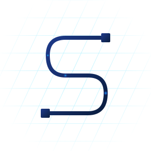

<div align="center">



# SpinalML

**Experimental Machine Learning Hardware Accelerators in Scala (SpinalHDL)**

*PyTorch-like developer ergonomics • Automated FPGA compilation • Validated physical FPGA inference*

<br/>

[](https://opensource.org/licenses/MIT)
[](https://www.python.org/)
[](https://www.scala-lang.org/)
[](https://spinalhdl.github.io/SpinalDoc-RTD/)
[](https://mill-build.org/)
[](https://www.veripool.org/verilator/)
[](https://yosyshq.net/yosys/)
[](https://github.com/YosysHQ/nextpnr)
[-blue.svg)](#supported-fpga-boards)
[](https://github.com/Juste-Leo2/spinalML/actions/workflows/ci-simulations.yml)
[](https://github.com/Juste-Leo2/spinalML/actions/workflows/ci-sentrux.yml)

</div>

---

SpinalML is an experimental hardware Machine Learning acceleration library designed for FPGA synthesis and simulation, written in Scala using [SpinalHDL](https://spinalhdl.github.io/SpinalDoc-RTD/). It bridges the gap between high-level deep learning concepts and silicon RTL, enabling developers and researchers to describe neural networks with a PyTorch-like API while generating functional, pipelined, cycle-accurate hardware.

> [!NOTE]
> **Student Research & Experimental Project**: SpinalML is an exploratory student project under active development. While end-to-end inference has been physically verified on hardware, primitives, quantization pipelines, and toolchain features are continuously evolving and should not be considered production-grade.

---

## Why SpinalML?

FPGA-based AI acceleration is typically confined to expensive enterprise platforms or locked behind opaque vendor tools. **SpinalML was born out of an experimental vision:** exploring neural network execution (with the long-term ambition of evaluating **quantized Small Language Models**) on **resource-constrained edge FPGAs**.

* **Transparent RTL**: Unlike traditional C-based HLS tools that can produce opaque Verilog, SpinalML generates deterministic, cycle-accurate RTL with full architectural visibility through SpinalHDL.
* **Resource-Conscious Design**: Custom mixed-precision (INT4, W4A8, FP8), temporal resource sharing, and double-buffered DMA streaming designed to fit models into devices with limited logic (down to 20K LUTs).
* **PyTorch-like Ergonomics with Hardware Control**: Define networks with a clean, declarative API (`Sequential`, `Conv2D`, `Linear`, `Attention`) while retaining direct visibility over physical registers, FIFOs, and DSP slices.

---

---

## Quick Start

### Option A: Standalone Precompiled CLI (Recommended)

SpinalML provides standalone, single-file executables for **Windows**, **Linux (x64 & ARM64)**, and **macOS** with zero Python dependencies required.

> [!NOTE]
> **Disk Space Requirement:**
> Please ensure you have **2 to 3 GB** of free disk space. Running `spinalml setup` automatically provisions the full open-source FPGA toolchain (OSS CAD Suite, Mill, Verilator, Yosys, nextpnr, openFPGALoader) into `~/.spinalml_tools`.

1. **Download the precompiled binary** for your operating system from the latest [**GitHub Releases**](https://github.com/Juste-Leo2/spinalML/releases).

2. **Add the binary to your PATH** to invoke `spinalml` from any directory:
   - **Linux / macOS**:
     ```bash
     chmod +x spinalml
     # Move to system PATH (e.g. /usr/local/bin) or export the folder:
     sudo mv spinalml /usr/local/bin/spinalml
     # or: export PATH="$PATH:/path/to/binary/folder"
     ```
   - **Windows (PowerShell)**:
     ```powershell
     # Add binary location to current session PATH (or add permanently in System Settings):
     $env:Path += ";$PWD"
     ```

3. **Initialize the toolchain:**
   ```bash
   spinalml setup
   ```

4. **Verify, compile & simulate a sample model directly (no git clone required):**
   Download the self-contained sample component [`Universal1DDemo.scala`](https://raw.githubusercontent.com/Juste-Leo2/spinalML/main/tests/universal/Universal1DDemo.scala):
   ```bash
   # Download standalone sample model
   curl -O https://raw.githubusercontent.com/Juste-Leo2/spinalML/main/tests/universal/Universal1DDemo.scala

   # Run bit-exact cycle-accurate C++ simulation with Verilator
   spinalml test Universal1DDemo.scala

   # Turnkey FPGA build for Sipeed Tang Primer 20K (Gowin GW2A-18)
   spinalml build Universal1DDemo.scala --board tang-primer-20k

   # Flash bitstream to SRAM via openFPGALoader
   spinalml flash --board tang-primer-20k
   ```

---

### Option B: Developer Environment from Source (with Python Co-Simulations)

If you are developing SpinalML or running **Python Cocotb co-simulations**, clone the repository and follow:

**[Guide: Setting up SpinalML from Source & Running All Tests](docs/building_from_source.md)**

*(Includes the essential Python 3.12 global interpreter requirement for Cocotb VPI on Ubuntu / WSL 2, and `uv` bootstrap instructions).*

---


## Real-World Application Examples

To see what you can build and run on physical silicon with SpinalML, check out the [`examples/`](examples/) directory:

- [**MNIST Hardware Accelerator on Tang Primer 20K**](examples/Mnist/README.md): A complete end-to-end demonstration featuring an ultra-compact mixed-precision (W4A8) CNN accelerator running in real time on the Gowin GW2A-18, paired with an interactive Gradio web drawing canvas and live UART telemetry.

---

## Beginner's Corner

SpinalML abstracts away tedious hardware handshakes. You can construct neural networks with high-level declarative components:

- **`Tensor[T]`**: Multi-dimensional tensor abstraction embedding physical hardware `Stream` interfaces (`valid` / `ready` handshakes).
- **Automated Pipelining**: Layers handle FIFO buffering, dimensional broadcasting, and backpressure automatically.
- **Sequential API**: Define your model cleanly using a PyTorch-like layer list.

### Minimal 1D Neural Network Example

```scala
import spinal.core._
import spinal.lib.bus.amba4.axi.Axi4Config
import spinalML.nn._
import spinalML.dtypes._

case class TinyMLP(
  override val axiConfig: Axi4Config = Axi4Config(addressWidth = 32, dataWidth = 64, idWidth = 4)
) extends Accelerator(
  dataType = I8(),             // 8-bit integer quantization
  inputShape = Seq(16, 1),     // 1D input vector of length 16
  modelSpec = Seq(
    Linear(inFeatures = 16, outFeatures = 32),
    ReLU(),
    Linear(inFeatures = 32, outFeatures = 4)
  ),
  axiConfig = axiConfig
)
```

No boilerplate `App` object or manual Verilog runner needed: the SpinalML CLI automatically elaborates your class, wraps it in the SoC bus, and compiles it directly:
```bash
python cli/main.py build TinyMLP.scala --board tang-primer-20k --no-dsp
```

---

## Advanced & Exploratory Features

For advanced experiments and architectural exploration, SpinalML provides modular hardware building blocks and quantization experiments:

- **Transformers & Attention Mechanisms**:
  - `ClassicalAttention(embedDim, numHeads)`: Multi-Head Attention blocks with batched streaming matrix multiplications (`matmul`) and hardware-accelerated Softmax.
- **Mixed Precision & Weight-Only Quantization (wXaY)**:
  - Run activations in floating-point (`FP8`, `BF16`) with compact integer weights (`I4`, `I8`) using `customWeightType` and compile-time `weightScales`.
  - On-the-fly precision adaptation via `Requantize(shift, targetType)` and `Cast(targetType)`.
- **2D Computer Vision**:
  - `Conv2D`, `MaxPool2D`, and `AvgPool2D` backed by BRAM-based line buffers (`Mem` + `readSync`) with zero CPU overhead.
  - Normalization layers: `LayerNorm` and inference-folded `BatchNorm`.
- **SoC & Memory Infrastructure**:
  - Autonomous AXI4 DMA memory engines (`DMAReader`, `DMAReader2D`) with `StreamDoubleBuffer` to overlap memory transfers with compute.
  - Hardware CSR bridge with UART packet framing for direct host-to-FPGA streaming inference.
- **Hardware LUT & Area Optimization Knobs**:
  - **`lanes` & `Repack(newLanes)`**: Bus streaming width (`lanes`) is automatically inferred per layer, but can be manually adapted via `Repack` to scale parallelism up or down to save routing LUTs.
  - **`temporal` Accumulator Streaming**: Matrix-multiplication layers accumulate full $M \times N$ output tables in registers by default (`temporal = 0`). Setting `temporal > 0` in `Accelerator(..., temporal = N)` drains completed rows on-the-fly, reclaiming thousands of LUTs and flip-flops on area-constrained FPGAs.

---

## Documentation Index

Explore detailed guides in the [`docs/`](docs/) directory:

- [**Getting Started Guide**](docs/getting_started.md): Core concepts, tensors, streams, and your first hardware layers.
- [**High-Level Tutorial**](docs/HighLevelTutorial.md): Complete guide to the PyTorch-like API, quantization, and DAG topologies.
- [**Operations API Reference**](docs/opsDocs.md): Detailed specifications of all supported hardware operations and layers.
- [**CLI Reference**](docs/cli.md): Commands for compilation, simulation, synthesis, formal verification, and flashing.
- [**Project Structure**](docs/project_structure.md): Repository layout, conventions, and architectural roadmap.
- [**UART Bridge & Protocol**](docs/uart_bridge.md): Specifications for physical UART host communication and CSR bridges.
- [**Application Examples**](examples/): Silicon-validated hardware projects, including the [Tang Primer 20K MNIST Accelerator](examples/Mnist/README.md).
- [**Supported FPGA Boards**](#supported-fpga-boards): Hardware compatibility matrix and supported vendor targets.

---

## Supported FPGA Boards

> [!IMPORTANT]
> **Current Hardware Status: 1 Board Supported & Tested**  
> Physical in-circuit synthesis, flashing, and real-time UART inference testing are currently validated **only on the Sipeed Tang Primer 20K** (Gowin GW2A-18).  
> The other platforms listed below represent theoretical architectural targets and an exploratory roadmap. If you own any of these boards and would like to test or contribute a validated profile, pull requests are warmly welcomed!

| Vendor | Board | FPGA Device | Toolchain / Programmer | Target Slug | Hardware Tested |
| :--- | :--- | :--- | :--- | :--- | :---: |
| **Gowin** | **Sipeed Tang Primer 20K** | GW2A-LV18PG256C8/I7 | Yosys + nextpnr-himbaechel / openFPGALoader | `tang-primer-20k` | ✅ **Validated** |
| Gowin | Sipeed Tang Nano 20K | GW2A-LV18QN88 | Yosys + nextpnr-himbaechel / openFPGALoader | `tang-nano-20k` | ❌ Untested |
| Gowin | Sipeed Tang Nano 9K | GW1NR-LV9QN88PC6/I5 | Yosys + nextpnr-himbaechel / openFPGALoader | `tang-nano-9k` | ❌ Untested |
| Gowin | Sipeed Tang Mega 138K | GW5AST-LV138FPG676A | Yosys / Gowin EDA / openFPGALoader | `tang-mega-138k` | ❌ Untested |
| **AMD / Xilinx** | Digilent Arty A7-35T / 100T | Artix-7 (XC7A35T / XC7A100T) | Yosys + nextpnr-xilinx / Vivado | `arty-a7` | ❌ Untested |
| AMD / Xilinx | Digilent Basys 3 | Artix-7 (XC7A35T) | Vivado / openFPGALoader | `basys3` | ❌ Untested |
| AMD / Xilinx | Digilent PYNQ-Z2 / Cora Z7 | Zynq-7000 (XC7Z020 / XC7Z010) | Vivado / PYNQ Linux (AXI PS-PL) | `pynq-z2` | ❌ Untested |
| AMD / Xilinx | AMD Kria KV260 / KR260 | Zynq UltraScale+ MPSoC | Vivado / Vitis AI | `kria-kv260` | ❌ Untested |
| **Lattice** | Lattice iCE40 UltraPlus (iCEBreaker) | iCE40UP5K-SG48 | Yosys + nextpnr-ice40 / iceprog | `ice40-up5k` | ❌ Untested |
| Lattice | Lattice ECP5 (Colorlight 5A-75B / OrangeCrab) | LFE5U-25F / 45F / 85F | Yosys + nextpnr-ecp5 / openFPGALoader | `ecp5` | ❌ Untested |
| **Intel / Altera** | Terasic DE10-Lite | MAX 10 (10M50DAF484C7G) | Quartus Prime / openFPGALoader | `de10-lite` | ❌ Untested |
| Intel / Altera | Terasic DE10-Nano | Cyclone V SE (5CSEBA6U23I7) | Quartus Prime / openFPGALoader | `de10-nano` | ❌ Untested |

---

## Contributing

Contributions are welcome! Whether you are adding support for a new FPGA board target, implementing hardware neural network layers, or improving toolchain automation, check out [**CONTRIBUTING.md**](CONTRIBUTING.md) to get started.

---

## Acknowledgements

- **[SpinalHDL](https://github.com/SpinalHDL/SpinalHDL)**: For providing an unmatched, expressive hardware description language that makes digital design concise, modular, and robust.
- **The [Yosys](https://github.com/YosysHQ/yosys) & Open-Source FPGA Community**: For building phenomenal open-source synthesis, PnR, and bitstream tools (`yosys`, `nextpnr`, `openFPGALoader`).

### Generative AI & Development Transparency

SpinalML is an individual student project. Designing a full-stack hardware ML acceleration library from scratch—spanning Scala/SpinalHDL RTL primitives, custom DMA streaming engines, automated CLI build pipelines, verification testbenches, and physical board deployment—would have been practically impossible for a single student to accomplish without the leverage of modern Generative AI.

- **AI Code Generation**: The vast majority of the code across this repository was generated with the assistance of LLMs:
  - **Gemini Flash & Pro** (via Antigravity)
  - **DeepSeek Flash & Pro** (via OpenCode)
  - **GLM 5.3 Flash** (via OpenCode)
- **Human Role & Quality Oversight**: The author's role focused on system architecture, engineering decisions, and quality control. Countless hours were dedicated to testing, debugging hardware timing and synthesis anomalies, designing verification testbenches, validating physical silicon inference over UART, and continuously reviewing generated code to ensure architectural integrity, rigor, and clean design patterns throughout the project.

---

## Citation

If you use SpinalML in your research or hardware projects, please cite:

```bibtex
@software{adamo2026spinalml,
  author       = {Adamo, Léonard},
  title        = {{spinalML: Hardware Machine Learning Accelerators with SpinalHDL}},
  year         = {2026},
  publisher    = {GitHub},
  journal      = {GitHub repository},
  howpublished = {\url{https://github.com/Juste-Leo2/spinalML}},
  note         = {Student project, Université de Montpellier, France}
}
```

---

## License

This project is licensed under the MIT License - see the [LICENSE](LICENSE) file for details.  
Copyright (c) 2026 Léonard Adamo.
