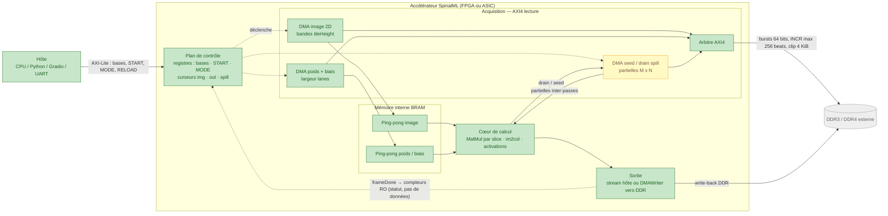
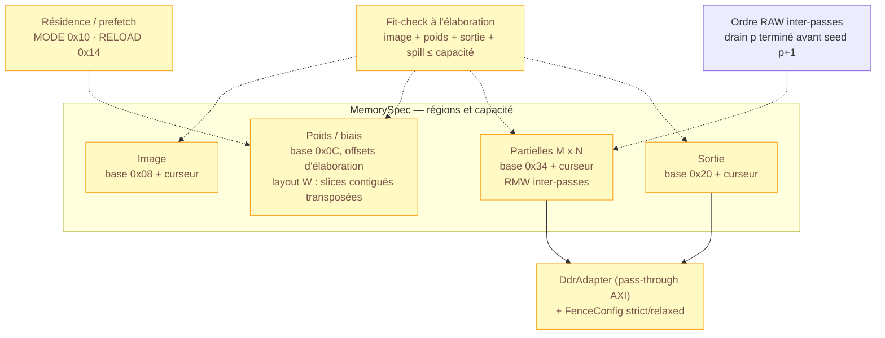
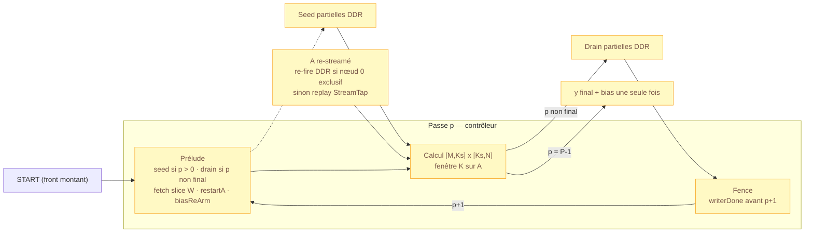

# Data Flow — Architecture actuelle & cap DDR

> **Statut** : à jour au 20/09/2026 (après la clôture du spill compute-side S0-S2
> et le formel contrôleur S3).
> **But** : une vue **synthétique** du flux de données réel, des concepts
> matériels (`lanes`, `temporal`, slices…) et de l'état de validation.
> **Contrats internes détaillés** (frontières de commande, pièges re-arm, gearboxes) :
> voir `docs/dataflow-map.md` — ce document-ci est la carte d'ensemble.
> **Docs liés** : `docs/ddr_impl.md` (tuyauterie DDR), `docs/ddr_final_impl.md`
> (spill compute-side S0-S3), `docs/tiling_resource_scaling.md` (cap scaling),
> `docs/roadmap_board.md` §4 (mémoire par board), `docs/project_structure.md`
> (structure du dépôt).

## Légende des statuts

| Couleur | Signification |
| :--- | :--- |
| 🟢 **Silicium** | tourne réellement sur Tang Primer 20K (GW2A-18), mémoire **on-chip BRAM uniquement** |
| 🟡 **Sim + formel** | implémenté et validé en simulation (`AxiMemorySim`/Verilator/cocotb), parfois prouvé formellement — **pas encore sur silicium** |
| ⚪ **Planifié** | logique amorcée ou route restante (DDR3 physique, extensions v2, scaling) |

---

## 1. Flux global actuel (one-shot)

**Lecture** :
1. **Plan de contrôle** : l'hôte programme les bases et pulse `START` ;
   `START` est un *handshake retenu* (`startPending`), jamais perdu.
2. **Acquisition** : image et poids/biais sont lus en bursts séquentiels —
   la méthode la plus rapide et la moins énergivore. Les poids d'une `Linear`
   sont streamés par beats de `weightLanes` éléments K ; les images par bandes
   (`tileHeight`) via `DMAReader2D`.
3. **Double buffering ping-pong** : pendant que le calcul consomme une banque,
   le DMA remplit l'autre. La latence de remplissage est **masquée en régime
   établi** (frontières de passe et fences restent visibles).
4. **Calcul** : le flux Tenseurs traverse les ops à la vitesse de l'horloge.
5. **Sortie — deux voies distinctes** :
   - **stream** (défaut, MNIST) : `compute -> io.outStream` vers l'hôte (UART) ;
   - **write-back DDR** (`OUT_CTRL 0x24`) : `compute -> DMAWriter -> AXI4 plein
     64 bits -> DDR` (`OUT_ADDR 0x20` + curseur) — c'est la **voie données**.
   Le plan de contrôle ne transporte **jamais** de données : `TILE_CNT 0x18`,
   `STATUS 0x04` et `DMA_STATUS 0x28` ne sont que des compteurs/drapeaux lus en
   AXI4-Lite (32 bits, quelques transactions par inférence → négligeable).

---

## 2. Plan de contrôle — CSR et curseurs

| Adresse | Nom | Rôle |
| :--- | :--- | :--- |
| `0x00` | START | pulse retenu jusqu'à acceptation (`startPending`) |
| `0x04` | STATUS | bit0 done (sticky DDR), bit1 busy, bit2 RUN |
| `0x08` | IMG_BASE | base image ; + curseur interne `imgBaseOffset` (RUN) |
| `0x0C` | WEIGHT_BASE | base des régions poids/biais (offsets élaborés) |
| `0x10` | MODE | bit0 `WEIGHT_RESIDENT`, bit1 `PREFETCH_EN` |
| `0x14` | RELOAD | write = refetch one-shot poids/biais |
| `0x18` | TILE_CNT | compteur de frames terminées (RO) |
| `0x1C` | RUN | bit0 auto-advance continu |
| `0x20` | OUT_ADDR | base sortie ; + curseur `outBaseOffset` |
| `0x24` | OUT_CTRL | bit0 write-to-DDR |
| `0x28` | DMA_STATUS | busy/done du writer |
| `0x30` | DEQUANT_SCALE | échelle runtime (Cast) |
| `0x34` | SPILL_BASE | base région spill ; + curseur `spillBaseOffset` |

Les **trois curseurs** (`img`, `out`, `spill`) sont remis à zéro par l'écriture
hôte de leur base — c'est le contrat de départ de flux (miroir
`imgBaseOffset`/`outBaseOffset` pour le spill).

---

## 3. Structure logique DDR — **en place**

Toute la **logique** DDR existe ; il ne manque que le **contrôleur physique**
DDR3 et sa calibration (voir §7).

Éléments en place :
- `MemorySpec` (régions + `capacityBytes`) et `Accelerator.reportFit` :
  fail-fast si l'empreinte dépasse la capacité déclarée.
- Maître AXI4 + **arbre d'arbitrage lecture** (spill seed inclus).
- Chemin d'écriture DDR : `DMAWriter` + `OUT_CTRL`, statut dédié.
- `DdrAdapter` : pass-through vers un contrôleur externe, avec
  `FenceConfig` strict DRAM / relaxé SRAM.
- Région spill `0x34` + curseur + fit (`totalSpillBytes`).

---

## 4. Concepts matériels existants

| Concept | Ce que c'est | Effet principal |
| :--- | :--- | :--- |
| `lanes` | éléments par beat d'un `Tensor` (stream) | largeur du bus interne / des beats |
| `weightLanes` / `effLanes` (Linear) | chunk K par beat de poids (M2) | LUT/DSP du MAC ; contrainte `Ks % effLanes == 0` (ordre fadd du réplica) |
| `temporal` | fenêtre M d'accumulateurs (`min(temporal,M) x N` slots) | échange FF/BRAM contre débit ; **requis >= 1 pour le spill** |
| `tileHeight` | tuilage image en bandes (`DMAReader2D` patches) | borne le buffer image BRAM |
| `spillKSlice` | largeur de tranche K par passe ; `P = K / Ks` | borne le buffer B (`Ks x N`) et le trafic DDR |
| `StreamTap` | replay on-chip de l'opérande A | nœud profond/partagé (pas de re-fire DDR), budget `spillReplayBudgetBytes` |
| Ping-pong `StreamDoubleBuffer` | deux banques BRAM + `reArm` (buffer + `DoubleBufferStreamer`) | masque la latence de fetch ; frontière de commande explicite |
| `TapBuffer` | fork DAG à capacité exacte (+ 1 slack beat) | branches différées sans famine ni duplication (M1.7 bis) |
| Résidence / prefetch | `MODE 0x10` bit0/bit1 + `RELOAD 0x14` | poids tenus on-chip / rafraîchis en tâche de fond |

> Cap scaling (tuiles physiques LUT/DSP vs slices BRAM/trafic, planner budgété
> board) : `docs/tiling_resource_scaling.md` — futur, axes M/K/N.

---

## 5. Boucle de passes spill (compute-side, implémentée)

Quand une couche `Linear` est spillée (`spillKSlice > 0`), le GEMM est découpé
en `P = K / Ks` passes ; les sommes partielles M x N font l'aller-retour DDR.

Détails contractuels (prouvés formellement) :
- **Prélude** : une commande seed par passe `p>0`, une commande drain par
  passe `p<P-1`, un refetch de slice W tenu jusqu'à acceptation, un pulse
  `restartA` (re-stream A), un pulse `biasReArm`.
- **Bias** : zéros hors passe finale, valeur réelle **une seule fois** sur la
  dernière passe.
- **Fence** : la passe `p+1` lit la région écrite par `p` seulement après le
  `writerDone` du drain (RAW sur une région unique).
- **Layout W** : chaque slice est stockée **transposée et contiguë**
  (`p*Ks*N + n*Ks + k_local`) — un whole-transpose legacy n'est pas découpable.
- **Contrat runtime** : `STREAM_PER_PASS` (`MODE 0x10 = 0`) ; résidence
  interdite sous spill (fail-safe : suppression de `refetchW`, pas de
  corruption silencieuse).

---

## 6. État de validation — réel / simulé / planifié

```mermaid
flowchart LR
    A["S0-S2 spill K-passes<br/>e2e bit-exact K=64 P=8<br/>+ contrôleur prouvé formel"] --> B["PR réplica spill<br/>layout slice-transposé · trafic mesuré"]
    B --> C["DDR3 physique sur Tang<br/>pins · calibration Gowin · mesures"]
    C --> D["Modèle plus gros que la BRAM<br/>flux continu, poids résidents"]
    D --> E["Tuilage piloté budget<br/>tiles/slices + planner R0-R3"]
    E --> F["Cœur plié (Phase 3)<br/>un moteur, descripteurs de couches"]

    classDef silicium fill:#c8e6c9,stroke:#2e7d32,color:#1b5e20
    classDef sim fill:#fff9c4,stroke:#f9a825,color:#795548
    classDef plan fill:#eeeeee,stroke:#9e9e9e,color:#616161
    class A sim
    class B,C plan
    class D,E,F plan
```

### 🟢 Tourne réellement sur silicium (Tang Primer 20K)

- CNN **MNIST W4A8** entièrement **on-chip (BRAM)**, hôte UART, canvas Gradio.
- Ressources réelles : **10 265 LUT4 (49,5 %), 25 DSP (52,1 %)**,
  Fmax estimée **36,42 MHz** (cible 27 MHz, timing MET).
- Latence : **~180 ms** aller-retour UART (~440 ms au premier run, upload poids).
- Adapter utilisé : `BramAdapter` (image/poids en BRAM) — **pas de DDR3**.

### 🟡 Implémenté et validé en simulation / formel

- **Spill compute-side S0-S2** : e2e bit-exact (nœud 0, nœud profond via
  `StreamTap`, échelles K8/K12/K16, K64-P8 au fit exact, rerun cohérent
  `TILE_CNT`/STOP/MODE/`0x34`) — `SequentialSpillTest` 10/10.
- **Formel contrôleur spill** : `SpillPassControllerFormal` (safety) +
  `SpillPassControllerLivenessFormal` (terminaison bornée), Boolector.
- **Plumbing DDR logique** : `MemorySpec` + fit, CSR/curseurs, arbre d'arbitrage,
  `DdrAdapter` (tests unitaires), chemin write-back (`DMAWriter` : formel
  `DMAWriterFormal` + cocotb `test_dma_writer.py`), `TILE_CNT` prouvé
  (`AcceleratorFormal`).
- **Résidence / prefetch** : validés bit-exact en sim (suites **archivées**,
  hors CI — réactivation prévue, dette P0 `wave6_ddr_scaling_plan.md`).
- **Tuilage image (`tileHeight`)** : validé en sim (suites archivées).

### ⚪ Planifié — la route restante

- **DDR3 physique** : pins, horloge, calibration du contrôleur Gowin, bande
  passante/latence mesurées (Phase 5b).
- **PR réplica spill** : outillage `WeightMemoryLayout` slice-transposé,
  comparaison `ModelReplica` e2e, trafic `P x (W_slice + A + 2 M N)` mesuré.
- **Spill v2** : A vers DDR (activations > on-chip), Conv/multi-couches
  spillées, N-split, spill x résidence.
- **Scaling** : tuilage M/K/N (tuiles vs slices) + planner budgété board
  (`tiling_resource_scaling.md`, R0-R3), cœur plié, flux continu/folding L2.

---

## 7. Lecture « ce qui reste pour la DDR de bout en bout »

1. **Filet P0** : restaurer les suites archivées (résidence/prefetch/continu/
   tuilage) dans `test-all` + smoke synthèse.
2. **PR réplica spill** (S3 restant, non bloquant).
3. **e2e `DdrAdapter` + `AxiMemorySim`** (niveau intégration).
4. **Phase 5b** : DDR3 sur Tang — `.cst`, calibration, `boards/*.json`
   (`ddr.present = true`, `size_bytes`, débit réel), modèle > BRAM, mesures.
5. **Extensions pour le cap** : A-spill v2 + flux continu.

> Repères : `ddr_final_impl.md` (§S3 = reste à faire), `ddr_impl.md` (Phases
> 5a/5b), `wave6_ddr_scaling_plan.md` (P0-P5), `tiling_resource_scaling.md`
> (futur scaling).

---

## Annexe — Vocabulaire express

| Terme | Définition |
| :--- | :--- |
| **Beat** | transfert AXI d'un mot (ici 64 bits) |
| **Slice** | bloc de données traité par passe (mémoire/trafic) |
| **Tuile (tile)** | forme matérielle instanciée par itération (LUT/DSP) — futur |
| **Chunk** | largeur d'éléments traitée par cycle (`lanes`) |
| **Passe** | une itération de la boucle spill (`p = 0 .. P-1`) |
| **RMW** | read-modify-write des partielles DDR entre passes |
| **RAW** | dépendance lecture-après-écriture (fence inter-passes) |
