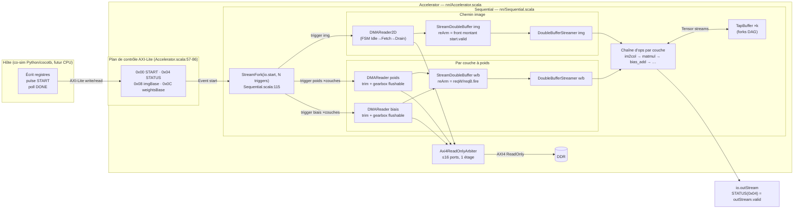
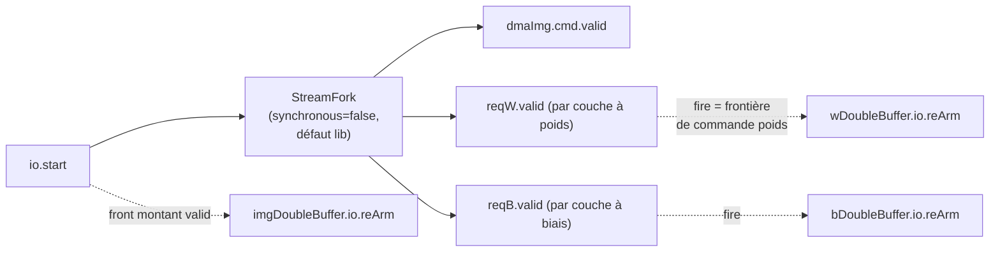
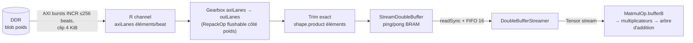
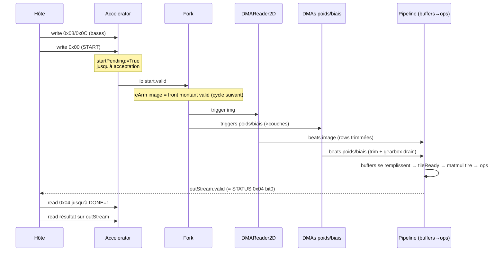
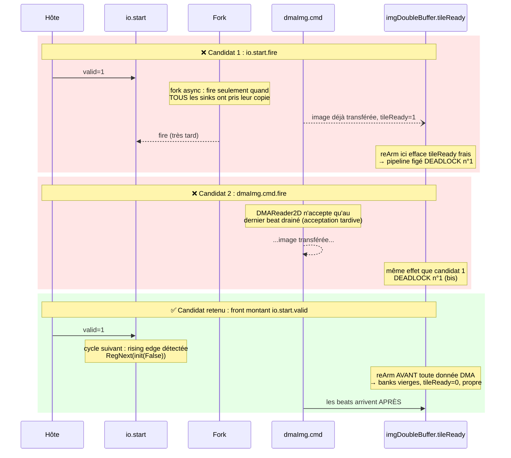

# Cartographie de la communication de données — spinalML

> **Objectif** : comprendre *comment les données circulent* entre les composants — protocoles,
> frontières de commandes, état persistant — pour que chaque piège rencontré (phases 0/1) devienne
> une case remplie plutôt qu'un souvenir flou. Ce document est l'anti-régression conceptuel du projet.
>
> **Comment lire** : chaque affirmation est ancrée à une ligne de code (`fichier:ligne`) ou à une
> section du rapport de session (`docs/bugs/2026-08-rearm-session.md`, abrégé « rapport RC »).
> Tout ce qui n'est **pas** encore compris est explicitement marqué ⚠️ MYSTÈRE OUVERT.
>
> **Rendu des diagrammes** : Mermaid se rend nativement sur GitHub / VS Code (extension Mermaid).
> Les blocs WaveDrom nécessitent l'extension VS Code « WaveDrom » ou https://wavedrom.com/editor.html .
>
> **Docs compagnons** : `docs/bugs/2026-08-rearm-session.md` (post-mortem détaillé),
> `docs/roadmap.md` (plan de route), `docs/symbolicTestPlaybook.md` (méthodo formelle).

---

## Table des matières

1. [Vue système bout-en-bout](#1-vue-système-bout-en-bout)
2. [Le protocole Stream en 5 minutes](#2-le-protocole-stream-en-5-minutes)
3. [Contrat de chaque composant](#3-contrat-de-chaque-composant)
4. [Les pièges vécus, en diagrammes](#4-les-pièges-vécus-en-diagrammes)
5. [Correctifs F1–F6 et zones d'ombre](#5-correctifs-f1f6-et-zones-dombre)
6. [Points d'accroche Phase 2](#6-points-daccroche-phase-2)
A. [Index des fichiers](#annexe-a--index-des-fichiers)

---

## 1. Vue système bout-en-bout

### 1.1 Schéma global



**Deux plans bien séparés :**

| Plan | Bus | Rôle | Source |
|---|---|---|---|
| Contrôle | AXI4-Lite esclave (8 bits d'adresse, 32 bits data) | Registres + déclenchement | Accelerator.scala:24,58 |
| Données | AXI4 **ReadOnly** maître (64 bits, idWidth 4) | Fetch img/poids/biais depuis la DDR | Accelerator.scala:34,45-52 |

Les canaux d'écriture AXI sont mis à la masse : le V1 ne fait qu'inférer, il n'écrit jamais en DDR
(Accelerator.scala:48-52). La sortie ressort par un stream Tensor dédié, pas par la mémoire.

### 1.2 Plan de contrôle — les registres

| Adresse | Nom | Écriture | Lecture | Comportement |
|---|---|---|---|---|
| `0x00` | START | pulse → `startPending := True` | — | L'hôte peut pulser quand il veut : la requête est **retenue** jusqu'à ce que le datapath l'accepte (`startEvent.fire`), puis `startPending` retombe |
| `0x04` | STATUS | — | bit 0 = DONE | Lit directement `io.outStream.stream.valid` |
| `0x08` | IMG_BASE | RW | RW | Adresse DDR de l'image d'entrée |
| `0x0C` | WEIGHTS_BASE | RW | RW | Adresse DDR du blob de poids (offsets internes calculés à l'élaboration) |

Sources : Accelerator.scala:60-86. Le point crucial : **START est un handshake, pas un pulse perdu**
— si le datapath est occupé, `startPending` reste haut et `io.start.valid` aussi.

### 1.3 Plan de données — le fork des déclencheurs

`Sequential` calcule `totalDmaTriggers = 1 (img) + Σ couches (poids? + biais?)`
(Sequential.scala:114) et distribue **une copie de l'événement START à chaque DMA** via un
`StreamFork` (Sequential.scala:115). Chaque branche :



⚠️ Subtilité capitale (§4.2) : le re-arm **image** et le re-arm **poids** n'utilisent pas la même
frontière — front montant de `valid` pour l'image, `fire` de sa propre commande pour les poids.
Ce n'est pas un hasard : c'est la seule combinaison qui fonctionne (voir §4.2).

### 1.4 Le chemin d'une donnée, de la DDR au calcul (exemple poids d'une couche)



Chaque étage a son propre contrat (§3) ; les trois causes racines de la session ré-armement sont
toutes nées d'un contrat mal lu à l'un de ces étages.

---

## 2. Le protocole Stream en 5 minutes

Tout le datapath interne parle le même dialecte : le **protocole Stream** de SpinalHDL.

### 2.1 Les trois signaux

| Signal | Signification | Règle d'or |
|---|---|---|
| `valid` | « Le producteur a une donnée » | Ne doit JAMAIS dépendre combinatoirement du `ready` aval (sinon risque de deadlock cyclique) |
| `ready` | « Le consommateur peut prendre » | Peut dépendre du `valid` amont |
| `fire = valid && ready` | « Transfert effectué CE cycle » | Seule vérité terrain d'un transfert |

### 2.2 Tensor = Stream habillé

Un `Tensor[T]` n'est rien d'autre qu'un wrapper autour de `Stream(Vec(T, lanes))`
(Tensor.scala:10-24). `lanes` = nombre d'éléments transportés par beat. Le beat final d'un tensor
peut être partiel (divisibilité non imposée, Tensor.scala:15-19) — c'est voulu, mais c'est là que
vivent les pièges de groupes partiels (RC2).

### 2.3 Acceptation précoce vs tardive d'une commande

C'est LE concept qui explique 80 % des bugs de la session ré-armement :

- **Acceptation précoce** : `cmd.ready` monte dès que l'état interne est libre, AVANT toute donnée.
  → `cmd.fire` est une bonne frontière de commande. Exemple : `DMAReader` 1D
  (DMAReader.scala:71-73).
- **Acceptation tardive** : `cmd.ready` ne monte qu'une fois la commande PRÉCÉDENTE entièrement
  drainée… ou pire, une fois les données de LA COMMANDE COURANTE déjà consommées.
  → `cmd.fire` arrive trop tard pour servir de frontière. Exemple fatal : `DMAReader2D` ne
  répond `io.cmd.ready := True` que sur le **dernier beat drainé de la dernière ligne**
  (DMAReader2D.scala:180).

### 2.4 État séquentiel persistant

Toute bascule (`Reg`) survit entre commandes tant que personne ne la remet à zéro. Compteurs,
flags de banks pleines, phase de gearbox, FIFOs partiellement remplies : tout cela traverse la
frontière d'inférence silencieusement. La règle du projet désormais : **chaque composant avec état
doit exposer un moyen explicite de revenir à son état initial entre commandes** (`io.reArm`,
`isEmpty`), et chaque appelant doit câbler cette frontière au bon signal (§4.2).

---

## 3. Contrat de chaque composant

Tableau synthétique, puis fiches détaillées pour les composants piégeux. Chemins relatifs à
`spinalML/src/spinalML/`.

| Composant | Ports clés | Acceptation cmd | État persistant entre commandes | Ré-armé par | Source |
|---|---|---|---|---|---|
| `Accelerator` | AXI-Lite, Event start, AXI4 RO, outStream | START retenu (`startPending`) | `startPending`, regs adresses | fire de l'Event consommé | nn/Accelerator.scala:60-86 |
| `Sequential` | Event, bases addr, AXI4 RO | fork vers N DMA | offsets élaborés (statiques) | — | nn/Sequential.scala:92-143 |
| `StreamFork` (lib) | 1 in → N out | input.ready quand TOUS ont pris leur copie | `linkEnable` (mode async) | — | lib Stream.scala:1291-1350 |
| `DMAReader` 1D | cmd FetchRequest, AXI4 RO, outStream | **Précoce** (état libre [+ gearbox vide]) | `remaining`, `burstRemain`, `addrReg`, compteur trim, phase gearbox | `cmd.fire` (auto-compteurs) + `flushableGearbox`/`trimToElements` | memory/DMAReader.scala:61-154 |
| `DMAReader2D` | cmd FetchRequest2D, AXI4 RO | **TARDIVE** : dernier beat drainé dernière ligne | FSM, `currentAddress/Row`, géométrie ligne, `elemCnt` | FSM revient à Idle (compteurs lignes reset par cycle) | memory/DMAReader2D.scala:145-188 |
| `StreamDoubleBuffer` | streamIn, readAddr/Data, nextTile/tileReady, reArm | streamIn.ready si bank pas pleine | `loadBank`, `computeBank`, `pingFull`, `pongFull`, `loadCounter` | **`io.reArm` obligatoire** | memory/StreamDoubleBuffer.scala:43-107 |
| `DoubleBufferStreamer` | readAddr/Data, nextTile/tileReady, streamOut | attend `tileReady` | `readCounter`, `isReading`, FIFO 16 | redémarre sur `tileReady` après swap | memory/DoubleBufferStreamer.scala:27-66 |
| `MatmulOp` | a, b, c, reArm | attend `tileReady` de bufferB | bufferB(s), accumulateurs M×N (init zéro), compteurs k/n/row/out | `io.reArm` → bufferB(s) uniquement | ops/matmul.scala:36-40,216-217 |
| `BiasAddOp` | a, b(lanes=1), c | FSM LoadBias d'abord | `biasMem` (rechargée à CHAQUE tensor), compteurs | boucle Done→LoadBias auto | ops/bias_add.scala:44-94 |
| `Im2ColOp` | a(lanes=1), c | FSM Fill | compteurs (reset à Done) MAIS `shiftReg`/`lineBuffers`/`tempVecs` **jamais vidés** ⚠️ | aucun pour les registres de fenêtre | ops/im2col.scala:206-215 |
| `RepackOp` legacy | a, c (+reArm ignoré) | transparent | phase du `StreamWidthAdapter` sous-jacent ⚠️ | AUCUN (cloison actuel : chemin image seulement) | ops/repack.scala:19-29 |
| `RepackOp` flushable | a, c, reArm, isEmpty | — | `hold/collect`, `idx`, `full` | `io.reArm` + drain avant nouvelle cmd | ops/repack.scala:31-80 |
| `TapBuffer` | in, directOut, tapOut | tee atomique (ready = direct && fifo) | FIFO capacité exacte du tensor | se vide naturellement (one-shot) | memory/TapBuffer.scala:28-38 |
| `Axi4ReadOnlyArbiter` (lib) | N in → 1 out | arbitrage standard | grant en cours | — | Sequential.scala:461-476 |

### 3.1 `StreamFork` — la sémantique exacte (lib)

Source : `/home/leo/SpinalHDL-1.14.2/.../lib/Stream.scala:1321-1350`.

> *"The input stream will block until all output streams have processed each item regardlessly."*
> (lignes 1325-1327)

Deux modes :

- **`synchronous = false`** (**notre cas**, défaut de l'objet apply, Stream.scala:1292) :
  chaque sortie peut accepter à un cycle différent (bit `linkEnable` par sortie, ligne 1344).
  MAIS l'input reste bloqué jusqu'à ce que toutes les sorties aient pris leur copie.
- **`synchronous = true`** : toutes les sorties firent le même cycle, au prix d'un hazard
  documenté par la lib elle-même : `outputs.foreach(_.valid := input.valid && input.ready)`
  (ligne 1349-1350) — le **valid dépend du ready**, violation explicite d'AXI (commentaire
  lignes 1328-1330).

**Conséquence projet** : dans les DEUX modes, `io.start.fire` n'est vrai que lorsque le DMA le
plus lent a accepté. C'est pourquoi `start.fire` est une frontière **trop tardive**
(rapport RC §2). Notre fork utilise le mode asynchrone : pas de hazard valid/ready, mais la règle
« tout le monde a pris » s'applique quand même.

### 3.2 `StreamWidthAdapter` (lib) — le parking de groupe partiel

Source : lib Stream.scala:2120-2153.

Sens large → étroit (down-conversion) : un `Counter(factor)` découpe chaque beat en tranches ;
aucun problème résiduel si les données arrivent par paquets complets.

Sens étroit → large (up-conversion, lignes 2138-2152) : un **registre `buffer`** accumule les
éléments (ligne 2143-2146) et un **`Counter`** décide quand émettre (ligne 2147) :

```scala
val counter = Counter(factor, inc = input.fire)
val buffer  = Reg(Bits(paddedOutputWidth - inputWidth bits))
when(input.fire){ buffer := input.payload ## (buffer >> inputWidth) }
output.valid := input.valid && counter.willOverflowIfInc
input.ready  := !(!output.ready && counter.willOverflowIfInc)
```

⚠️ **Ni `counter` ni `buffer` ne connaissent la notion de "commande"** : si une commande se
termine alors que `counter ≠ 0`, les éléments orphelins restent parkés et **déphasent la
commande suivante**. C'est la mécanique exacte de RC2 (rapport RC §1, RC2).

### 3.3 `DMAReader` 1D — acceptation précoce + chaîne de nettoyage

- Frontière : `io.cmd.ready := baseReady && gearboxEmpty` (DMAReader.scala:71-73) — précoce,
  car `baseReady` ne regarde que les compteurs de la commande précédente, terminée.
- Bursts : découpage INCR ≤ `maxBurstBeats` (256), clip 4 KiB, stricte sérialisation AR/R
  (DMAReader.scala:57-97).
- Trim exact (`trimToElements`) : supprime tout élément au-delà de `shape.product` ; compteur
  `sent` remis à zéro à chaque `cmd.fire` (DMAReader.scala:143-154). Combat RC1 côté poids/biais.
- Gearbox flushable (`flushableGearbox`) : RepackOp structuré dont `isEmpty` participe à
  `cmd.ready` — on n'accepte une nouvelle commande que lorsque la queue de la précédente est
  drainée (DMAReader.scala:68-73,130-134). Combat RC2 côté poids/biais.

### 3.4 `DMAReader2D` — l'acceptation tardive fatale

FSM `Idle → Fetch → Drain*` (DMAReader2D.scala:145-188). `io.cmd.ready := True` n'apparaît QUE
dans `stateDrain`, sur le fire du dernier beat de la dernière ligne (ligne 180) :

```
cmd.valid ─────────────────────────────────────█ ← prêt ici seulement
                                               ↑
   l'image entière a DÉJÀ traversé le composant │
```

Conséquence : `dmaImg.io.cmd.fire` survient **après** que la première bank du double buffer est
pleine — réarmer sur ce signal efface un `tileReady` fraîchement monté et fige le pipeline
(deadlock n°1 du rapport RC §2). Utilisez ce fire comme indicateur « image N consommée », jamais
comme frontière « image N+1 commence ».

### 3.5 `StreamDoubleBuffer` — ping/pong et re-arm

- Deux banks BRAM, `streamIn.ready := !currentLoadBankFull` (backpression, pas de perte,
  StreamDoubleBuffer.scala:63).
- `tileReady` reflète la bank de calcul pleine ; `nextTile` bascule `computeBank` et libère la
  bank (78-97).
- `io.reArm` (101-107) remet TOUT à l'état power-on : banks, flags, compteur. Dernier assigne-
  ment gagne : le re-arm écrase toute autre mise à jour du même cycle.
- **Taille contractuelle** : la bank doit faire EXACTEMENT `depth/lanes` beats du tensor —
  sinon `tileReady` ne monte jamais (commentaire Sequential.scala:146-149).

### 3.6 `MatmulOp` — consommation tirée, re-arm propagé

Le B-tile est bufferisé dans un `StreamDoubleBuffer` interne dont le `io.reArm` est un port du
composant (matmul.scala:36-40), alimenté par les couches avec le fire du DMA poids
(Sequential.scala:199,244,309,329,402,404). Sans lui, un `tileReady` périmé laisse la matmul
N+1 démarrer sur les données de N (RC1/RC3 côté compute).

Note architecture : tout est **tiré** (pull) par le calcul — le `tileReady` autorise, les
`ready` aval dictent le rythme. Le prefetch Phase 2 introduira du **poussé** (push) ; c'est LE
couplage à concevoir (§6).

### 3.7 `Im2ColOp` — état de fenêtre jamais vidé ⚠️

Les compteurs sont remis à zéro dans `stateDone` (im2col.scala:206-215) mais `shiftReg`,
`lineBuffers` et `tempVecs` conservent les pixels de l'image précédente. Aujourd'hui sans
conséquence : aucune fenêtre n'est émise avant que K lignes fraîches soient passées
(`isWindowValid`, im2col.scala:83). Mais c'est un état inter-inférences réel, à garder en tête
pour la résidence (Phase 2) et le multi-tile.

---

## 4. Les pièges vécus, en diagrammes

### 4.1 Une inférence normale (référence)



Lecture des résultats : le bench lit `outStream` après polling de STATUS (MnistTest.scala,
protocol `runInference`). Le V1 n'a pas de write-back DDR.

### 4.2 La frontière de commande : trois candidates, deux deadlocks

Pourquoi le re-arm image est câblé sur le **front montant de `io.start.valid`**
(Sequential.scala:160-161) :



La règle générale qui en sort : **la frontière d'une commande doit précéder le premier octet de
données de cette commande**. Pour les poids/biais, `reqW.fire`/`reqB.fire` respectent cette
règle car les readers 1D acceptent de façon précoce (§3.3) — d'où l'asymétrie img/poids.

### 4.3 RC1 — les beats de padding polluent les buffers à taille exacte

La DDR livre des beats entiers. Une région de 50 éléments I4 sur bus 64 bits (16 éléments/beat)
occupe `ceil(50/16)=4` beats = **64 éléments physiques**, dont 14 de padding région. Sans trim :

```wavedrom
{head:{text:"RC1 — 50 éléments I4 sur bus 64b (16 él/beat) : 4 beats = 64 physiques", tick:0},
 signal:[
  {name:"AXI R beats",        wave:"====",     data:["b0: e0–e15","b1: e16–e31","b2: e32–e47","b3: e48,e49 + 14 PAD"]},
  {name:"flux sans trim",     wave:"======",   data:["g0 (e0–e3)","g1","g2","…","g15 (e60–e63)","PAD"]},
  {name:"bank0 BRAM (50 pl.)",wave:"=........",data:["50 premiers éléments OK"]},
  {name:"bank1 BRAM",         wave:"=.....",   data:["14 PAD (junk persistant !)"]},
  {name:"tileReady",          wave:"01"},
 ]}
```

> Le junk de bank1 précède les données de l'inférence suivante → corruption inter-start.

Le padding finit dans la bank BRAM ; pire, si la bank suivante reçoit le début de l'inférence
suivante pendant que les flags survivent, l'inférence N+1 démarre sur des données décalées
(rapport RC §1 RC1). Correctif : `trimToElements` (DMAReader.scala:143-154) + tailles exactes
des buffers (Sequential.scala:149,243,289).

### 4.4 RC2 — la phase de gearbox retenue entre commandes

Exemple : flux 16 lanes → 4 lanes (`factor=4`). Une commande livre 18 éléments = 4 groupes
complets + **2 orphelins** parkés dans le `buffer`/`Counter` de l'adapter (§3.2). La commande
suivante démarre déphasée de 2 :

```wavedrom
{head:{text:"RC2 — parking d'un groupe partiel dans l'adapter (16 lanes → 4 lanes, factor=4)", tick:0},
 signal:[
  {name:"cmd#1 éléments in",      wave:"=====",     data:["e0–e3","e4–e7","e8–e11","e12–e15","e16,e17 (fin cmd#1)"]},
  {name:"groupes out cmd#1",      wave:"====",      data:["G0","G1","G2","G3"]},
  {name:"adapter interne",        wave:"=.",        data:["PARKED: e16,e17"]},
  {name:"cmd#2 éléments in",      wave:"=====",     data:["f0,f1","f2–f5","f6–f9","f10–f13","f14–f17"]},
  {name:"groupes out cmd#2",      wave:".====",     data:["[e16,e17,f0,f1] ⚠","f2–f5","…déphasé de 2"]},
 ]}
```

Correctif : gearbox structurée flushable (`RepackOp withFlush=true`, ops/repack.scala:31-80)
dont `io.reArm` vide l'état et `io.isEmpty` participe à l'acceptation de la commande suivante
(DMAReader.scala:68-73). Activée UNIQUEMENT sur les readers poids/biais (Sequential.scala:220-221,267-268).

Note : quand le ratio n'est pas multiple (ex. 16 → 25 lanes pour un kernel Conv2D 5×5),
`repack.apply` chaîne DEUX RepackOps en passant par lanes=1 (repack.scala:104-108) — deux
parkings potentiels au lieu d'un, d'où l'importance du drain/flush systématique.

### 4.5 Le cloison actuel — pourquoi deux gearboxes cohabitent

| Chemin | Gearbox utilisée | Pourquoi |
|---|---|---|
| Image (DMAReader2D) | Adapter **legacy** (repack.scala:22-26) | Lignes complétées par beats entiers, groupes alignés : le contrat « group-aligned » tient, pacing battle-tested |
| Poids/Biais (DMAReader 1D) | Structurée **flushable** | Régions finissant en milieu de groupe : le parking résiduel est systématique |

⚠️ MYSTÈRE OUVERT (rapport RC §5) : la gearbox structurée, seule, perturbe le DAG ResidualMLP
alors que les micro-probes standalone sont bit-parfaits — interaction sensible au pacing/stalls,
non localisée à ce jour. Toute généralisation du chemin flushable (ex. image multi-tile) devra
attendre la dissection de ce comportement (jalon début/milieu Phase 2).
**Analyse complète, hypothèses classées et plan de dissection : `docs/open-mysteries.md` (M1).**

---

## 5. Correctifs F1–F6 et zones d'ombre

Récapitulatif (détail complet dans le rapport RC §3) :

| ID | Fichier | Correctif | Piège traité |
|---|---|---|---|
| F1 | memory/StreamDoubleBuffer.scala:33,101-107 | Port `io.reArm` (reset banks/flags/compteur) | RC1+RC3 |
| F2 | nn/Sequential.scala:160-161 | Re-arm image = front montant `start.valid` | RC3 (frontière) |
| F3 | nn/Sequential.scala:246,291 + ops/matmul.scala:39,87,217 + layers/* | Re-arm poids/biais = `reqW/reqB.fire`, propagation MatmulOp | RC3 (frontières par-DMA) |
| F4 | memory/DMAReader.scala:143-154 | `trimToElements` (fin de stream alignée groupe) | RC1 |
| F5 | ops/repack.scala:31-80 | RepackOp dual-mode + gearbox structurée flushable (`reArm`,`isEmpty`) | RC2 |
| F6 | memory/DMAReader.scala:36-42,68-73 | `flushableGearbox` activée poids/biais seulement (cloison §4.5) | RC2 |

Zones d'ombre assumées :

1. ⚠️ **Gearbox flushable × DAG** (non expliqué, §4.5) — dissection obligatoire avant généralisation. Détails : `docs/open-mysteries.md` (M1).
2. ⚠️ **État de fenêtre im2col** inter-inférences (§3.7) — inoffensif prouvé en one-shot, à re-vérifier en multi-tile. Détails : `docs/open-mysteries.md` (M2).
3. Formels BMC non encore relancés avec les nouveaux ports (`reArm`/`isEmpty`) — harnais compilés, runs reportés (roadmap §8).

---

## 6. Points d'accroche Phase 2

Ce que la carte révèle pour la suite (résidence des poids, préfetch) :

1. **Les frontières existent déjà par-DMA** : `reqW.fire`/`reqB.fire` armés indépendamment.
   ⚠️ CORRECTION AU SPRINT (Phase 2a réalisée, août 2026) : l'hypothèse « résidence presque
   gratuite » était **fausse en un point** — sans refill, le `nextTile` de fin de consommation
   vide le flag du bank courant et bascule sur le bank jumeau (vide) : `tileReady` meurt et la
   rediffusion ne redémarre jamais. La solution livrée = primitive `residentHold` sur
   `StreamDoubleBuffer` (gèle flag + pointeur ; `reArm` garde la priorité last-wins pour qu'un
   reload se comporte comme une passe normale). Le streamer, lui, est naturellement rejouable.
2. ✅ **Livré en Phase 2a** :
   - branches poids/biais du fork conditionnelles dans Sequential (fetch si 1ᵉʳ usage / RELOAD /
     **front montant du mode** — ce front s'auto-fetch une fois car le pointeur hérite d'un bank
     vide d'une passe legacy ; impulsion one-cycle → verrou sticky consommé par le `cmd.fire`) ;
   - CSR `0x10` bit0 = WEIGHT_RESIDENT (défaut STREAM_PER_PASS), `0x14` write = RELOAD one-shot ;
   - validation : `WeightResidentChainTest` (BF16+W4A8 bit-exactes, AR poids **strictement 0**
     en régime établi, anti-vacuité RELOAD) + formel `StreamDoubleBufferHoldFormal`.
3. **Le couplage poussé/tiré** (préfetch 2b, RESTE À FAIRE) : aujourd'hui tout est tiré par le
   calcul (§3.6). Préfetcher couche N+1 pendant N introduit du poussé : le WeightManager devra
   arbitrer le maître AXI unique (img(N) ∥ weights(N+1)) et signaler « poids prêts » par couche.
4. **Compatibilité résidence vérifiée empiriquement** : `biasAdd` recharge son `biasMem` à CHAQUE
   tensor depuis le flux re-diffusé ✓ ; les buffers B internes des matmuls reçoivent une copie
   fraîche du flux à chaque passe → se comportent comme nourris par DMA ✓ ; im2col fenêtres
   périmées (§3.7/M2) réécrites avant usage, OK — à surveiller en tiling Phase 3.
5. ~~Jalon préalable gearbox×DAG~~ : levé (M1.7 open-mysteries — cloison principé).

---

## Annexe A — Index des fichiers

| Fichier | Contenu |
|---|---|
| `spinalML/src/spinalML/nn/Accelerator.scala` | Top-level SoC : AXI-Lite + AXI4 RO + Event |
| `spinalML/src/spinalML/nn/Sequential.scala` | Orchestration : fork, DMAs, buffers, graphe d'ops, arbiter |
| `spinalML/src/spinalML/memory/DMAReader.scala` | Reader 1D : bursts, trim, gearbox flushable |
| `spinalML/src/spinalML/memory/DMAReader2D.scala` | Reader image : FSM lignes, trim head/tail |
| `spinalML/src/spinalML/memory/StreamDoubleBuffer.scala` | Ping/pong BRAM + reArm |
| `spinalML/src/spinalML/memory/DoubleBufferStreamer.scala` | Lecteur séquentiel + FIFO |
| `spinalML/src/spinalML/memory/TapBuffer.scala` | Fork DAG à capacité exacte |
| `spinalML/src/spinalML/ops/repack.scala` | Gearbox dual-mode (legacy/flushable) |
| `spinalML/src/spinalML/ops/matmul.scala` | MatmulOp + buffer B interne |
| `spinalML/src/spinalML/ops/bias_add.scala` | Broadcast add, rechargement par tensor |
| `spinalML/src/spinalML/ops/im2col.scala` | Fenêtres glissantes (état de fenêtre persistant) |
| `spinalML/src/spinalML/tensors/Tensor.scala` | Définition Tensor = Stream(Vec(dtype, lanes)) |
| `tests/python/test_dma_reader*.py` | Co-sim cocotb : mock AXI RAM + checks |
| `docs/bugs/2026-08-rearm-session.md` | Post-mortem complet phases 0/1 |
| `docs/open-mysteries.md` | Registre des comportements non expliqués (M1 gearbox×DAG, M2 im2col) + avertissements lib à relire |
| Lib : `/home/leo/SpinalHDL-1.14.2/.../lib/Stream.scala` | Fork (:1321), WidthAdapter (:2120) |
