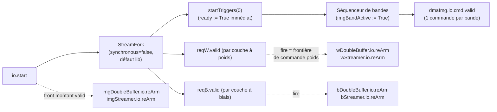
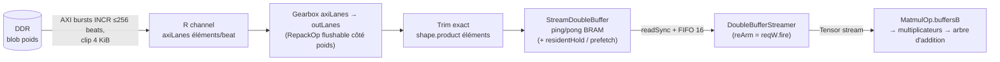
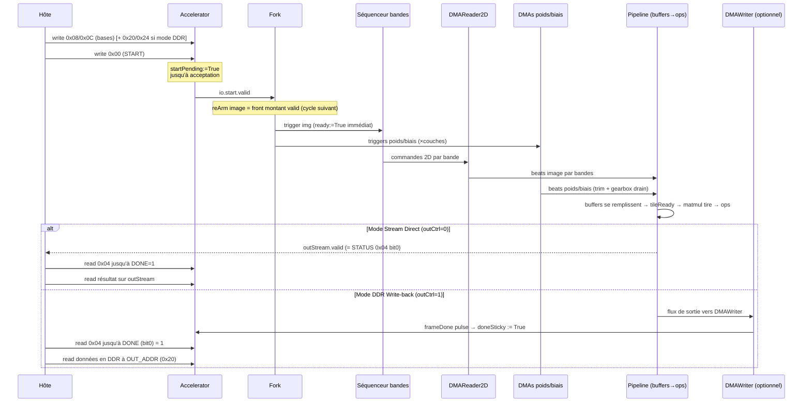
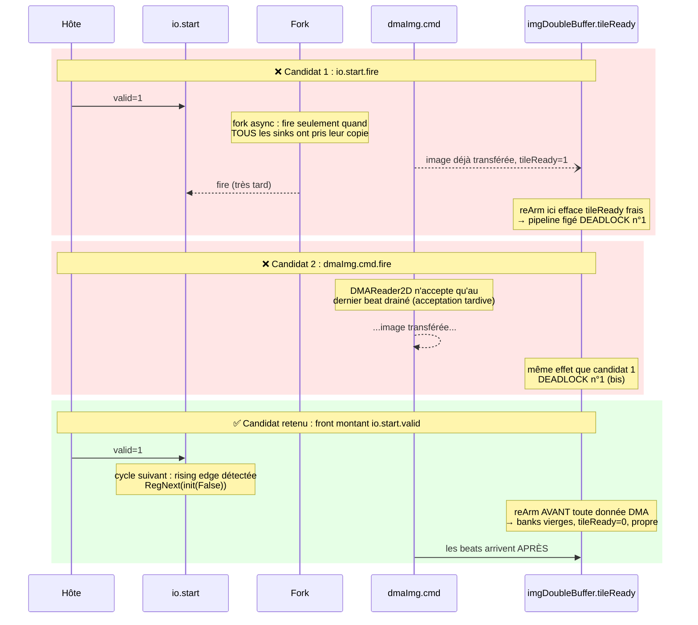

# Cartographie de la communication de données — spinalML

> **Objectif** : comprendre *comment les données circulent* entre les composants — protocoles,
> frontières de commandes, état persistant — pour que chaque piège rencontré (phases 0 à 4) devienne
> une case remplie plutôt qu'un souvenir flou. Ce document est l'anti-régression conceptuel du projet.
>
> **Comment lire** : chaque affirmation est ancrée à une ligne de code (`fichier:ligne`) ou à une
> section du rapport de session (`docs/bugs/2026-08-rearm-session.md`, abrégé « rapport RC »).
> Tout ce qui n'est **pas** encore compris est explicitement marqué ⚠️ MYSTÈRE OUVERT.
>
> **Rendu des diagrammes** : Mermaid se rend nativement sur GitHub / VS Code (extension Mermaid).
> Les blocs WaveDrom nécessitent l'extension VS Code « WaveDrom » ou https://wavedrom.com/editor.html .
>
> **Docs compagnons** : `docs/data_flow.md` (vue synthétique à jour : architecture
> actuelle, concepts `lanes`/`temporal`/slices, structure logique DDR et statut
> silicium/sim/planifié), `docs/ddr_impl.md` (tuyauterie DDR), `docs/ddr_final_impl.md`
> (spill compute-side S0-S3), `docs/bugs/2026-08-rearm-session.md` (post-mortem détaillé),
> `docs/roadmap.md` (plan de route), `docs/symbolicTestPlaybook.md` (méthodo formelle).

---

## Table des matières

1. [Vue système bout-en-bout](#1-vue-système-bout-en-bout)
2. [Le protocole Stream en 5 minutes](#2-le-protocole-stream-en-5-minutes)
3. [Contrat de chaque composant](#3-contrat-de-chaque-composant)
4. [Les pièges vécus, en diagrammes](#4-les-pièges-vécus-en-diagrammes)
5. [Correctifs F1–F9 et zones d'ombre](#5-correctifs-f1f9-et-zones-dombre)
6. [Points d'accroche Phases 2 à 4](#6-points-daccroche-phases-2-à-4)
A. [Annexe A — Index des fichiers](#annexe-a--index-des-fichiers)

---

## 1. Vue système bout-en-bout

### 1.1 Schéma global

```mermaid
flowchart LR
    subgraph HOST["Hôte (co-sim Python/cocotb, UART, futur CPU)"]
        SW["Écrit registres CsrMap<br/>pulse START<br/>poll DONE / STATUS"]
    end

    subgraph SOC["Accelerator — nn/Accelerator.scala"]
        subgraph CTRL["Plan de contrôle AXI-Lite (CsrMap / Accelerator.scala:95-123,203-388)"]
            REG["0x00 START · 0x04 STATUS<br/>0x08 imgBase · 0x0C weightsBase<br/>0x10 MODE · 0x14 RELOAD · 0x18 TILE_CNT · 0x1C RUN<br/>0x20 outAddr · 0x24 outCtrl · 0x28 dmaStatus · 0x34 spillBase"]
        end

        subgraph SEQ["Sequential — nn/Sequential.scala"]
            FORK["StreamFork(io.start, totalDmaTriggers)<br/>Sequential.scala:301"]
            subgraph IMGPATH["Chemin image (banded 2D fetch)"]
                IBAND["Séquenceur de bandes<br/>imgBandActive, nBands"]
                DMA2D["DMAReader2D<br/>(FSM Idle→Fetch→Drain)"]
                DBUF_I["StreamDoubleBuffer img<br/>reArm = front montant start.valid"]
                ST_I["DoubleBufferStreamer img<br/>reArm = front montant start.valid"]
            end
            subgraph WBPATH["Par couche à poids / biais"]
                DMAB_W["DMAReader poids<br/>trim + gearbox flushable"]
                DMAB_B["DMAReader biais<br/>trim + gearbox flushable"]
                DBUF_W["StreamDoubleBuffer w/b<br/>reArm = reqW/reqB.fire<br/>(residentHold / prefetch)"]
                ST_W["DoubleBufferStreamer w/b<br/>reArm = reqW/reqB.fire"]
            end
            OPS["Chaîne d'ops par couche<br/>im2col → matmul → bias_add → …"]
            TAP["TapBuffer ×k<br/>(forks DAG, cap tensor + 1 slack)"]
        end

        ARB_R["Axi4ReadOnlyArbiter<br/>≤8 ports/étage (arbre 2 étages si &gt;8)"]
        DWR["DMAWriter<br/>(write-back DDR optionnel)"]
        ARB_W["Axi4WriteOnlyArbiter<br/>(spill drain + DMAWriter)"]
        DDR[("DDR3 / DDR4 / BRAM")]
    end

    SW -->|"AXI-Lite write/read"| REG
    REG -->|"Event start"| FORK
    FORK -->|"startTriggers(0) [ready:=True]"| IBAND
    IBAND -->|"cmd par bande"| DMA2D
    FORK -->|"trigger poids ×couches"| DMAB_W
    FORK -->|"trigger biais ×couches"| DMAB_B
    DMA2D --> DBUF_I --> ST_I --> OPS
    DMAB_W --> DBUF_W --> ST_W --> OPS
    DMAB_B --> DBUF_W
    OPS <-->|"Tensor streams"| TAP
    OPS -->|"Stream direct (outCtrl=0)"| OUT["io.outStream (UART / testbench)"]
    OPS -->|"Mode DDR (outCtrl bit0=1)"| DWR
    DMA2D --> ARB_R
    DMAB_W --> ARB_R
    DMAB_B --> ARB_R
    ARB_R -->|"AXI4 Read (AR/R)"| DDR
    DWR --> ARB_W
    ARB_W -->|"AXI4 Write (AW/W/B)"| DDR
```



**Deux plans bien séparés :**

| Plan | Bus | Rôle | Source |
|---|---|---|---|
| Contrôle | AXI4-Lite esclave (8 bits d'adresse, 32 bits data) | Registres figés (`CsrMap`) + déclenchement | Accelerator.scala:49,95-123,203-388 |
| Données | AXI4 **Read/Write** maître (64 bits, idWidth configurable) | Fetch img/poids/biais, write-back sortie (`DMAWriter`), partielles spill | Accelerator.scala:67-73,79-80,125-184 |

**Deux voies de sortie complémentaires :**
- **Mode Stream direct** (`OUT_CTRL 0x24` bit 0 = 0) : la sortie finale ressort directement sur `io.outStream` sans écriture en mémoire (utilisé pour les flux UART et tests MNIST simples).
- **Mode DDR write-back** (`OUT_CTRL 0x24` bit 0 = 1) : `DMAWriter` écrit le tenseur résultant en DDR à l'adresse programmée dans `OUT_ADDR` (0x20, incrémentée du curseur `outBaseOffset` sous mode RUN continu).
- **Modèles avec Spilling** (Phase 4) : le writer de drain de spill et le `DMAWriter` de sortie partagent le canal d'écriture via un arbitre 2:1 `Axi4WriteOnlyArbiter` (`Accelerator.scala:135-157`).

### 1.2 Plan de contrôle — les registres

L'adresse de chaque registre est gelée de façon unique dans `CsrMap.scala` :

| Adresse | Nom | Écriture | Lecture | Comportement |
|---|---|---|---|---|
| `0x00` | START | pulse → `startPending := True` | — | L'hôte pulse pour déclencher l'inférence. La requête est **retenue** jusqu'à ce que le datapath l'accepte (`startEvent.fire`), puis `startPending` retombe |
| `0x04` | STATUS | — | bit 0 = DONE<br/>bit 1 = BUSY<br/>bit 2 = RUN | Bit 0 : `doneSticky` en mode DDR (mémorisé jusqu'au prochain START) ou `io.outStream.stream.valid` en mode direct.<br/>Bit 1 : `model.io.busy \|\| dmaWriter.io.busy`.<br/>Bit 2 : état actif du mode RUN (`runActive`) |
| `0x08` | IMG_BASE | RW | RW | Adresse DDR de l'image d'entrée. Une écriture réinitialise le curseur `imgBaseOffset` |
| `0x0C` | WEIGHT_BASE | RW | RW | Adresse DDR du blob de poids (offsets internes calculés à l'élaboration) |
| `0x10` | MODE | RW | RW | bit 0 = `WEIGHT_RESIDENT` (maintien on-chip), bit 1 = `PREFETCH_EN` (rafraîchissement masqué en tâche de fond) |
| `0x14` | RELOAD | pulse (W) | — | Toute écriture déclenche un rechargement one-shot des poids/biais à la prochaine frontière |
| `0x18` | TILE_CNT | — | RO | Compteur de frames complètes terminées depuis le reset (incrémenté à chaque `frameDone`) |
| `0x1C` | RUN | RW | RW | bit 0 = auto-advance continu : réémet START et avance les curseurs d'adresse (`imgBaseOffset`, `outBaseOffset`) à chaque `frameDone` |
| `0x20` | OUT_ADDR | RW | RW | Adresse DDR de sortie pour `DMAWriter`. Une écriture réinitialise `outBaseOffset` |
| `0x24` | OUT_CTRL | RW | RW | bit 0 = `writeToDdr` (active la redirection vers `DMAWriter` au lieu de `io.outStream`) |
| `0x28` | DMA_STATUS | — | RO | bit 0 = busy, bit 1 = done du `DMAWriter` |
| `0x30` | DEQUANT_SCALE | RW | RW | Facteur d'échelle runtime pour les couches `Cast` configurées avec `runtimeScale = true` |
| `0x34` | SPILL_BASE | RW | RW | Adresse DDR de la région de spill des accumulateurs (Phase 4). Une écriture réinitialise `spillBaseOffset` |

Sources : `CsrMap.scala:16-56`, `Accelerator.scala:95-123,203-388`. Le point crucial : **START est un handshake retenu**, pas une impulsion volatile.

### 1.3 Plan de données — le fork des déclencheurs

`Sequential` calcule `totalDmaTriggers = 1 (img) + Σ couches (poids? + biais?)` (`Sequential.scala:300`) et distribue une copie de l'événement START via un `StreamFork` (`Sequential.scala:301`).



**Subtilités de synchronisation :**
1. **Séquenceur de bandes image (Phase 3)** : `startTriggers(0).ready` est forcé à `True` (`Sequential.scala:373`). Le trigger START de l'image est absorbé instantanément par un petit séquenceur d'état (`imgBandActive`), qui délivre ensuite les commandes bande par bande à `DMAReader2D` à mesure que chaque bande est consommée (`dmaImg.io.cmd.fire`).
2. **Mode résident (Phase 2a)** : quand `WEIGHT_RESIDENT` est actif et que la région est déjà chargée (`fetchNowW == False`), `startTriggers(idx).ready` est également forcé à `True` (`Sequential.scala:561`). Le fork ne bloque donc pas sur les DMA déjà résidents.
3. **Frontières de re-arm** : le re-arm **image** et le re-arm **poids/biais** n'utilisent pas la même frontière — front montant de `start.valid` pour l'image, `fire` de la commande respective (`reqW.fire`/`reqB.fire`) pour les poids et biais (§4.2).

### 1.4 Le chemin d'une donnée, de la DDR au calcul (exemple poids d'une couche)



---

## 2. Le protocole Stream en 5 minutes

Tout le datapath interne parle le même dialecte : le **protocole Stream** de SpinalHDL.

### 2.1 Les trois signaux

| Signal | Signification | Règle d'or |
|---|---|---|
| `valid` | « Le producteur a une donnée » | Ne doit JAMAIS dépendre combinatoirement du `ready` aval (sinon risque de deadlock cyclique) |
| `ready` | « Le consommateur peut prendre » | Peut dépendre du `valid` amont |
| `fire = valid && ready` | « Transfert effectué CE cycle » | Seule vérité terrain d'un transfert |

### 2.2 Tensor = Stream habillé

Un `Tensor[T]` est un wrapper typé autour de `Stream(Vec(T, lanes))` (`Tensor.scala:10-24`). `lanes` = nombre d'éléments transportés par beat. Le beat final d'un tensor peut être partiel (divisibilité non imposée, `Tensor.scala:15-19`) — c'est voulu, mais c'est là que vivent les pièges de groupes partiels (RC2).

### 2.3 Acceptation précoce vs tardive d'une commande

C'est le concept clé qui explique la majorité des deadlocks de ré-armement :

- **Acceptation précoce** : `cmd.ready` monte dès que l'état interne est libre, AVANT toute donnée.
  → `cmd.fire` est une excellente frontière de commande. Exemple : `DMAReader` 1D (`DMAReader.scala:73-75`).
- **Acceptation tardive** : `cmd.ready` ne monte qu'une fois la commande PRÉCÉDENTE entièrement
  drainée… ou pire, une fois les données de LA COMMANDE COURANTE déjà consommées.
  → `cmd.fire` arrive trop tard pour servir de frontière. Exemple : `DMAReader2D` ne
  répond `io.cmd.ready := True` que sur le **dernier beat drainé de la dernière ligne**
  (`DMAReader2D.scala:188`).

### 2.4 État séquentiel persistant

Toute bascule (`Reg`) survit entre commandes tant que personne ne la remet à zéro. Compteurs, flags de banques pleines, phase de gearbox, FIFOs partiellement remplies : tout cela traverse la frontière d'inférence silencieusement.
La règle du projet : **chaque composant avec état doit exposer un moyen explicite de revenir à son état initial entre commandes** (`io.reArm`, `isEmpty`), et chaque appelant doit câbler cette frontière au bon signal (§4.2).

---

## 3. Contrat de chaque composant

Tableau synthétique, puis fiches détaillées pour les composants piégeux. Chemins relatifs à `spinalML/src/spinalML/`.

| Composant | Ports clés | Acceptation cmd | État persistant entre commandes | Ré-armé par | Source |
|---|---|---|---|---|---|
| `Accelerator` | AXI-Lite slave, AXI4 master (RW), io.outStream, busy, done | START retenu (`startPending`) | `startPending`, `doneSticky`, regs adresses, curseurs (`imgBaseOffset`, `outBaseOffset`, `spillBaseOffset`), `tileCntReg` | fire de l'Event consommé (`startPending := False`), host writes pour réinitialiser les curseurs | `nn/Accelerator.scala:78-123, 203-388`, `nn/CsrMap.scala` |
| `Sequential` | Event, bases addr, AXI4 master (RO + spillWrite), startTriggers | fork vers N triggers DMA (bander accepte immédiatement, poids immédiats si résidents) | offsets élaborés, `imgBandIdx`, `imgBandActive`, latches reload | front montant `start.valid` (img), `reqW.fire`/`reqB.fire` (poids/biais) | `nn/Sequential.scala:298-384, 535-640, 660-728, 1090-1129` |
| `StreamFork` (lib) | 1 in → N out | input.ready quand TOUS ont pris leur copie | `linkEnable` (mode async) | — | lib `Stream.scala:1321-1350` |
| `DMAReader` 1D | cmd FetchRequest, AXI4 RO, outStream | **Précoce** (`baseReady && gearboxEmpty`) | `remaining`, `burstRemain`, `addrReg`, compteur trim, phase gearbox | `cmd.fire` (auto-compteurs) + `flushableGearbox`/`trimToElements` | `memory/DMAReader.scala:50-160` |
| `DMAReader2D` | cmd FetchRequest2D, AXI4 RO, outStream | **TARDIVE** : dernier beat drainé dernière ligne (ligne 188) | FSM, `currentAddress/Row`, `cmdHeight/Stride`, `elemCnt` | FSM revient à Idle (compteurs reset) | `memory/DMAReader2D.scala:50-196` |
| `StreamDoubleBuffer` | streamIn, readAddr/Data, nextTile/tileReady, reArm, opt: `residentHold`, `stageRequest`, `loadCanAccept`, `tileFilled`, `refreshSettled` | streamIn.ready si banque pas pleine (`!currentLoadBankFull`) | `loadBank`, `computeBank`, `pingFull`, `pongFull`, `loadCounter`, `switchArmed` | **`io.reArm` obligatoire** (remet tout à l'état power-on) ; neutralisé sur nextTile par `residentHold` | `memory/StreamDoubleBuffer.scala:41-69, 157-164` |
| `DoubleBufferStreamer` | readAddr/Data, nextTile/tileReady, streamOut, **`reArm`** | attend `tileReady` | `readCounter`, `popCounter`, `isReading`, `tileActive`, FIFO 16 | **`io.reArm`** (clear compteurs, `isReading := False`, `tileActive := False`, `fifo.flush := True`) | `memory/DoubleBufferStreamer.scala:17-32, 90-97` |
| `MatmulOp` | a, b, c, reArm, opt: `spillIn`, `spillOut`, `passFirst`, `passLast`, `passDone` | attend `tileReady` de `buffersB` | buffersB(s), accumulateurs M×N (init zéro), compteurs k/row/out | `io.reArm` → `buffersB(s)` | `ops/matmul.scala:69-86, 137-138` |
| `BiasAddOp` | a, b(lanes=1), c, **`reArm`** | FSM `LoadBias` d'abord | `biasMem`, `loadCounter`, `aCounter` | **`io.reArm`** (`loadCounter.clear()` en LoadBias ; `aCounter.clear()` + `goto(stateLoadBias)` en Process) | `ops/bias_add.scala:24-29, 46-99` |
| `Im2ColOp` | a(lanes=inLanes), c | FSM `Fill` | compteurs (reset à Done) MAIS `shiftReg`/`lineBuffers`/`tempVecs` **jamais vidés** ⚠️ | aucun pour les registres de fenêtre (inoffensif tant que de nouvelles lignes sont lues) | `ops/im2col.scala:28-31, 73, 181-191` |
| `RepackOp` legacy | a, c (+reArm ignoré) | transparent | phase du `StreamWidthAdapter` sous-jacent ⚠️ | AUCUN (cloison actuel : chemin image seulement) | `ops/repack.scala:21-32` |
| `RepackOp` flushable | a, c, reArm, isEmpty | `!full` | `hold/collect`, `idx`, `full` | `io.reArm` (`full := False; idx := 0`) + drain avant nouvelle cmd (`isEmpty`) | `ops/repack.scala:33-83` |
| `TapBuffer` | in, directOut, tapOut, opt: dbg | té atomique (`streamIn.ready := directOut.ready && fifo.push.ready`) | FIFO capacité `depth / lanes + 1` (slack pour té atomique) | se vide naturellement (one-shot) | `memory/TapBuffer.scala:19-71` |
| `Axi4ReadOnlyArbiter` (lib) | N in → 1 out | arbitrage standard Round-Robin | grant en cours | — | `nn/Sequential.scala:1090-1129` (fan-in 8, arbre 2 étages si > 8, bypass si 1 master) |

### 3.1 `StreamFork` — la sémantique exacte (lib)

Source : `/home/leo/SpinalHDL-1.14.2/.../lib/Stream.scala:1321-1350`.

Deux modes :
- **`synchronous = false`** (**notre cas**, défaut de l'objet apply, `Stream.scala:1292`) : chaque sortie peut accepter à un cycle différent (bit `linkEnable` par sortie, ligne 1344). MAIS l'input reste bloqué jusqu'à ce que toutes les sorties aient pris leur copie.
- **`synchronous = true`** : toutes les sorties firent le même cycle, au prix d'un hazard documenté par la lib : `valid` dépendant combinatoirement de `ready`.

**Conséquence projet** : `Sequential` évite le blocage du fork :
- Pour l'image, `startTriggers(0).ready := True` immédiat (`Sequential.scala:373`) : le séquenceur de bandes absorbe la commande instantanément.
- Pour les poids résidents (`fetchNowW == False`), `startTriggers(idx).ready := True` immédiat (`Sequential.scala:561`).

### 3.2 `StreamWidthAdapter` (lib) — le parking de groupe partiel

Source : lib `Stream.scala:2120-2153`.

Sens large → étroit (down-conversion) : un `Counter(factor)` découpe chaque beat en tranches ; aucun problème résiduel si les données arrivent par paquets complets.

Sens étroit → large (up-conversion, lignes 2138-2152) : un **registre `buffer`** accumule les éléments et un **`Counter`** décide quand émettre :

```scala
val counter = Counter(factor, inc = input.fire)
val buffer  = Reg(Bits(paddedOutputWidth - inputWidth bits))
when(input.fire){ buffer := input.payload ## (buffer >> inputWidth) }
output.valid := input.valid && counter.willOverflowIfInc
input.ready  := !(!output.ready && counter.willOverflowIfInc)
```

⚠️ **Ni `counter` ni `buffer` ne connaissent la notion de "commande"** : si une commande se termine alors que `counter ≠ 0`, les éléments orphelins restent parkés et **déphasent la commande suivante** (RC2).

### 3.3 `DMAReader` 1D — acceptation précoce + chaîne de nettoyage

- Frontière : `io.cmd.ready := (if (flushableGearbox) baseReady && gearboxEmpty else baseReady)` (`DMAReader.scala:73-75`) — précoce, car `baseReady` ne regarde que les compteurs de la commande précédente, terminée.
- Bursts : découpage INCR ≤ `maxBurstBeats` (256), clip 4 KiB, sérialisation stricte AR/R (`DMAReader.scala:59-99`).
- Trim exact (`trimToElements`) : supprime tout élément au-delà de `shape.product` ; compteur `sent` remis à zéro à chaque `cmd.fire` (`DMAReader.scala:149-160`). Combat RC1 côté poids/biais.
- Gearbox flushable (`flushableGearbox`) : RepackOp structuré dont `isEmpty` participe à `cmd.ready` — on n'accepte une nouvelle commande que lorsque la queue de la précédente est drainée (`DMAReader.scala:73-75, 135-141`). Combat RC2 côté poids/biais.

### 3.4 `DMAReader2D` — l'acceptation tardive fatale

FSM `Idle → Fetch → Drain` (`DMAReader2D.scala:153-196`). `io.cmd.ready := True` n'apparaît QUE dans `stateDrain`, sur le fire du dernier beat de la dernière ligne (ligne 188) :

```
cmd.valid ─────────────────────────────────────█ ← prêt ici seulement (ligne 188)
                                               ↑
   l'image entière a DÉJÀ traversé le composant │
```

Conséquence : `dmaImg.io.cmd.fire` survient **après** que la banque du double buffer est pleine — réarmer sur ce signal effacerait un `tileReady` fraîchement monté et figerait le datapath (deadlock n°1 du rapport RC §2). C'est pourquoi l'image est réarmée sur le front montant de `start.valid`, et séquencée en bandes.

### 3.5 `StreamDoubleBuffer` — ping/pong, re-arm et extensions Phase 2

- Deux banques BRAM, `streamIn.ready := !currentLoadBankFull` (backpressure, pas de perte, `StreamDoubleBuffer.scala:101`).
- `tileReady` reflète la banque de calcul pleine ; `nextTile` bascule `computeBank` et libère la banque (`StreamDoubleBuffer.scala:88, 119-122`).
- `io.reArm` (lignes 157-164) remet TOUT à l'état power-on : banques, drapeaux, pointeurs. Dernier assignement gagne : le re-arm écrase toute autre mise à jour du même cycle.
- **Extensions de résidence (Phase 2a)** : port optionnel `residentHold` — gèle le flag de la banque courante et neutralise `nextTile`, permettant au streamer de relire indéfiniment la même banque sans trafic DDR.
- **Extensions de prefetch (Phase 2b)** : ports `stageRequest`, `loadCanAccept`, `tileFilled`, `refreshSettled` — autorisent un swap unique gouverné (`switchArmed`) à la prochaine frontière de passe (`StreamDoubleBuffer.scala:107-124`).

### 3.6 `DoubleBufferStreamer` — lecture séquentielle et flush de FIFO

- Attend `tileReady` pour démarrer (`DoubleBufferStreamer.scala:42-45`).
- Émet séquentiellement les adresses de lecture via un `Stream(UInt)` avec disponibilité de FIFO > 1 (`DoubleBufferStreamer.scala:80`).
- Gère la latence BRAM d'un cycle à l'aide d'une `StreamFifo(Vec, 16)`.
- **Port `io.reArm`** (`DoubleBufferStreamer.scala:31, 90-97`) : réinitialise l'automate de lecture (`isReading := False`, `tileActive := False`), efface les compteurs `readCounter` et `popCounter`, et vide la FIFO (`fifo.io.flush := True`). Il est impératif de le câbler avec le `reArm` du buffer sous peine de laisser la FIFO streamer des éléments résiduels.

### 3.7 `MatmulOp` — consommation tirée, re-arm propagé

Le B-tile est bufferisé dans des `StreamDoubleBuffer` internes (`buffersB`, `matmul.scala:137-138`) dont le `io.reArm` est relié au port du composant (`matmul.scala:76`). Ce port est alimenté par les couches via le fire du DMA poids (`Sequential.scala:626-627, 734, 754, 908`). Sans lui, un `tileReady` périmé laisse la matmul N+1 démarrer sur les données de N.

### 3.8 `BiasAddOp` — rechargement et port reArm

- Charge le vecteur de biais dans `biasMem` une fois par tenseur (`bias_add.scala:47-61`).
- **Port `io.reArm`** (`bias_add.scala:28, 57-59, 94-97`) : en état `LoadBias`, il efface `loadCounter` ; en état de calcul `Process`, il réinitialise `aCounter` et force un retour immédiat en `stateLoadBias` (`goto(stateLoadBias)`).

### 3.9 `Im2ColOp` — état de fenêtre persistant ⚠️

Les compteurs `x`, `y`, `channelCount`, `windowCount` et `outChunkCount` sont remis à zéro dans `stateDone` (`im2col.scala:181-190`), mais `shiftReg`, `lineBuffers` et `tempVecs` conservent les pixels de l'image précédente. Aujourd'hui sans conséquence : aucune fenêtre n'est émise avant que K lignes fraîches soient passées (`isWindowValid`, `im2col.scala:73`).

---

## 4. Les pièges vécus, en diagrammes

### 4.1 Une inférence normale (référence)



### 4.2 La frontière de commande : trois candidates, deux deadlocks

Pourquoi le re-arm image est câblé sur le **front montant de `io.start.valid`** (`Sequential.scala:402-419`) :



Règle générale : **la frontière d'une commande doit précéder le premier mot de données de cette commande**. Pour les poids/biais, `reqW.fire`/`reqB.fire` respectent cette règle car les readers 1D acceptent de façon précoce (§3.3) — d'où l'asymétrie voulue img/poids.

### 4.3 RC1 — les beats de padding polluent les buffers à taille exacte

La DDR livre des beats entiers. Une région de 50 éléments I4 sur bus 64 bits (16 éléments/beat) occupe `ceil(50/16)=4` beats = **64 éléments physiques**, dont 14 de padding. Sans trim :

```wavedrom
{head:{text:"RC1 — 50 éléments I4 sur bus 64b (16 él/beat) : 4 beats = 64 physiques", tick:0},
 signal:[
  {name:"AXI R beats",        wave:"====",     data:["b0: e0–e15","b1: e16–e31","b2: e32–e47","b3: e48,e49 + 14 PAD"]},
  {name:"flux sans trim",     wave:"======",   data:["g0 (e0–e3)","g1","g2","…","g15 (e60–e63)","PAD"]},
  {name:"bank0 BRAM (50 pl.)",wave:"=........",data:["50 premiers éléments OK"]},
  {name:"bank1 BRAM",         wave:"=.....",   data:["14 PAD (junk persistant !)"]},
  {name:"tileReady",          wave:"01"},
 ]}
```

Correctif : `trimToElements` (`DMAReader.scala:149-160`) + dimensionnement exact des tampons (`Sequential.scala:391, 534, 669`).

### 4.4 RC2 — la phase de gearbox retenue entre commandes

Exemple : flux 16 lanes → 4 lanes (`factor=4`). Une commande livre 18 éléments = 4 groupes complets + **2 orphelins** parkés dans le `buffer`/`Counter` de l'adapter (§3.2). La commande suivante démarre déphasée de 2 :

```wavedrom
{head:{text:"RC2 — parking d'un groupe partiel dans l'adapter (16 lanes → 4 lanes, factor=4)", tick:0},
 signal:[
  {name:"cmd#1 éléments in",      wave:"=====",     data:["e0–e3","e4–e7","e8–e11","e12–e15","e16,e17 (fin cmd#1)"]},
  {name:"groupes out cmd#1",      wave:"====",      data:["G0","G1","G2","G3"]},
  {name:"adapter interne",        wave:"=.",        data:["PARKED: e16,e17"]},
  {name:"cmd#2 éléments in",      wave:"=====",     data:["f0,f1","f2–f5","f6–f9","f10–f13","f14–f17"]},
  {name:"groupes out cmd#2",      wave:".====",     data:["[e16,e17,f0,f1] ⚠","f2–f5","…déphasé de 2"]},
 ]}
```

Correctif : gearbox structurée flushable (`RepackOp withFlush=true`, `ops/repack.scala:33-83`) dont `io.reArm` vide l'état et `io.isEmpty` participe à l'acceptation de la commande suivante (`DMAReader.scala:73-75`).

### 4.5 Le cloison actuel — pourquoi deux gearboxes cohabitent

| Chemin | Gearbox utilisée | Pourquoi |
|---|---|---|
| Image (`DMAReader2D`) | Adapter **legacy** (`repack.scala:21-32`) | Lignes complétées par beats entiers, groupes alignés : contrat « group-aligned » respecté, pacing battle-tested |
| Poids/Biais (`DMAReader` 1D) | Structurée **flushable** (`repack.scala:33-83`) | Régions finissant en milieu de groupe : le parking résiduel est systématique |

### 4.6 Piège TapBuffer — té atomique et slack FIFO (M1.7 bis)

Dans un DAG, un nœud bifurque vers une branche directe et une branche différée via `TapBuffer` (`TapBuffer.scala:19-71`).
Si la FIFO était dimensionnée à la capacité strictement exacte du tenseur (`depth / lanes`), et que le consommateur direct bloque sur le dernier beat, la source maintient `valid = 1`. Le té atomique ré-acquiert ce beat maintenu et l'insère une deuxième fois dans le chemin direct, provoquant une corruption de flux (découverte M1.7 bis sur WideResidual).
**Correctif** : allocation de `entries = Math.max(1, depth / lanes) + 1` (+1 entrée de slack, `TapBuffer.scala:21, 49-55`) pour absorber ce beat d'attente sans doubler la livraison.

---

## 5. Correctifs F1–F9 et zones d'ombre

Récapitulatif des correctifs anti-régression :

| ID | Fichier | Correctif | Piège traité |
|---|---|---|---|
| F1 | `memory/StreamDoubleBuffer.scala:54, 157-164` | Port `io.reArm` (reset banques/flags/compteurs) | RC1+RC3 |
| F2 | `nn/Sequential.scala:402-419` | Re-arm image = front montant `start.valid` | RC3 (frontière image) |
| F3 | `nn/Sequential.scala:626-627, 716-717` + `ops/matmul.scala:76, 138` | Re-arm poids/biais = `reqW/reqB.fire`, propagation `MatmulOp.buffersB` | RC3 (frontières par-DMA) |
| F4 | `memory/DMAReader.scala:149-160` | `trimToElements` (fin de stream alignée groupe) | RC1 |
| F5 | `ops/repack.scala:33-83` | RepackOp dual-mode + gearbox structurée flushable (`reArm`, `isEmpty`) | RC2 |
| F6 | `memory/DMAReader.scala:44, 73-75` | `flushableGearbox` activée poids/biais seulement (cloison §4.5) | RC2 |
| F7 | `memory/DoubleBufferStreamer.scala:31, 90-97` | Port `io.reArm` (clear compteurs, FSM reset, flush FIFO 16) | Désynchronisation buffer/streamer |
| F8 | `ops/bias_add.scala:28, 57-59, 94-97` | Port `io.reArm` (clear `loadCounter`/`aCounter`, retour forcé à `LoadBias`) | Biais périmé inter-inférence |
| F9 | `memory/TapBuffer.scala:21, 49-55` | Entrée de slack `depth/lanes + 1` sur la FIFO de té atomique | M1.7 bis (beat dupliqué en skip-chain) |

Zones d'ombre assumées :
1. ⚠️ **Gearbox flushable × DAG** (`docs/open-mysteries.md`, M1) — interaction sensible au pacing/stalls sur chemins complexes, cloisonnée au lecteur de poids/biais.
2. ⚠️ **État de fenêtre im2col inter-inférences** (§3.9, M2) — inoffensif en one-shot tant que K lignes sont injectées avant lecture.

---

## 6. Points d'accroche Phases 2 à 4

### 6.1 Phase 2a — Résidence des poids (`WEIGHT_RESIDENT`)
- **Primitive `residentHold`** sur `StreamDoubleBuffer` (`StreamDoubleBuffer.scala:58, 115`) : neutralise `nextTile` de façon à conserver la banque pleine pour les inférences suivantes.
- **CSR `0x10` bit0** = `WEIGHT_RESIDENT` ; **CSR `0x14` write** = `RELOAD` one-shot (`Accelerator.scala:375-388`).
- Validation : `WeightResidentChainTest` (trafic AR poids strictement nul en régime établi).

### 6.2 Phase 2b — Prefetch masqué des poids (`PREFETCH_EN`)
- **CSR `0x10` bit1** = `PREFETCH_EN` : les rafraîchissements de poids s'exécutent en tâche de fond dans la banque IDLE pendant que la banque courante est consommée.
- **Governed swap** (`switchArmed`, `refreshSettled`) : la bascule vers la nouvelle banque s'effectue strictement à la frontière de fin de passe (`nextTile`), jamais en cours de flux.

### 6.3 Phase 3 — Tuilage image en bandes (`tileHeight`)
- Découpe de l'image en `nBands` verticales (`Sequential.scala:338-362`).
- Séquenceur d'état `imgBandActive` qui absorbe le `startTriggers(0)` immédiatement (`ready := True`) et déclenche les commandes 2D par bande à mesure que le datapath les consomme.

### 6.4 Phase 4 — Spilling compute-side des accumulateurs (`spill`)
- Découpage du GEMM en `P = K / Ks` passes (`spillKSlice`) pour franchir le mur de mémoire BRAM (`docs/ddr_final_impl.md`).
- Les sommes partielles sont évacuées vers la DDR (`CSR 0x34 SPILL_BASE`) via `DMAWriter` et re-seedées à la passe suivante avec strict respect de la fence RAW (`writerDone`).

### 6.5 Mode continu streaming (`RUN`)
- **CSR `0x1C` bit0** = `RUN` (`Accelerator.scala:288-324`) : à chaque `frameDone`, le matériel réémet automatiquement un START interne et fait glisser `imgBaseOffset` (+ taille image) et `outBaseOffset` (+ taille sortie). Permet le traitement vidéo continu sans intervention CPU entre chaque frame.

---

## Annexe A — Index des fichiers

| Fichier | Contenu |
|---|---|
| `spinalML/src/spinalML/nn/Accelerator.scala` | Top-level SoC : AXI-Lite + AXI4 Master (R/W) + Event + curseurs RUN |
| `spinalML/src/spinalML/nn/CsrMap.scala` | Définition gelée de l'espace d'adressage des registres CSR |
| `spinalML/src/spinalML/nn/Sequential.scala` | Orchestration : fork, DMAs, buffers, graphe d'ops, séquenceur bandes, arbitre AXI |
| `spinalML/src/spinalML/memory/DMAReader.scala` | Reader 1D : bursts 4 KiB, trim exact, gearbox flushable |
| `spinalML/src/spinalML/memory/DMAReader2D.scala` | Reader image 2D : FSM lignes, trim head/tail, acceptation tardive |
| `spinalML/src/spinalML/memory/DMAWriter.scala` | Moteur d'écriture AXI4 pour le write-back DDR et le spill |
| `spinalML/src/spinalML/memory/StreamDoubleBuffer.scala` | Ping/pong BRAM + reArm + residentHold + prefetch FSM |
| `spinalML/src/spinalML/memory/DoubleBufferStreamer.scala` | Lecteur séquentiel + FIFO 16 + port reArm |
| `spinalML/src/spinalML/memory/TapBuffer.scala` | Fork DAG à té atomique avec entrée de slack (`depth/lanes + 1`) |
| `spinalML/src/spinalML/ops/repack.scala` | Gearbox dual-mode (legacy / flushable structurée) |
| `spinalML/src/spinalML/ops/matmul.scala` | MatmulOp + buffers B internes ping-pong + reArm |
| `spinalML/src/spinalML/ops/bias_add.scala` | Broadcast add, rechargement par tenseur + port reArm |
| `spinalML/src/spinalML/ops/im2col.scala` | Fenêtres glissantes 2D (état de fenêtre persistant) |
| `spinalML/src/spinalML/tensors/Tensor.scala` | Définition Tensor = Stream(Vec(dtype, lanes)) |
| `docs/data_flow.md` | Vue d'ensemble synthétique de l'architecture et statut silicium/sim |
| `docs/ddr_impl.md` & `ddr_final_impl.md` | Tuyauterie DDR et spécification du spill compute-side S0-S3 |
| `docs/bugs/2026-08-rearm-session.md` | Post-mortem exhaustif des deadlocks de ré-armement (RC1 à RC3) |
| `docs/open-mysteries.md` | Registre des comportements non expliqués (M1 gearbox×DAG, M2 im2col) |
