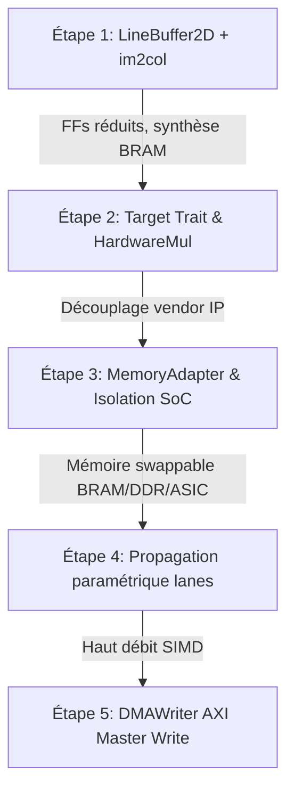

# Plan de Refactorisation Dual-Target (FPGA & ASIC) — Architecture à 3 Couches

> **Date** : Septembre 2026  
> **Auteur** : Léonard Adamo (Juste-Leo2) & Antigravity  
> **Branche active** : `refactoring`  
> **Objectif** : Assainir et découpler le socle SpinalML existant pour garantir une portabilité stricte entre cibles FPGA (Gowin GW2A-18 / Tang Primer 20K, Xilinx) et cibles ASIC (OpenLane, SkyWater 130nm, GF180MCU) sans duplication de code.

---

## 1. L'Architecture Cible : Le « Sandwich à 3 Couches »

Pour qu'une unique base de code serve à la fois d'émulateur matériel bit-exact sur FPGA et de RTL prêt pour le placement-routage silicium (ASIC), les responsabilités sont strictement partitionnées en trois couches étanches :

```
┌────────────────────────────────────────────────────────────────────────┐
│  COUCHE 1 : CŒUR ALGORITHMIQUE SPINALML (100% Portable RTL)           │
│  - Flux de données valid/ready (`Stream[Tensor]`), contre-pression     │
│  - Opérateurs arithmétiques génériques (Conv2D, Matmul, Activations)   │
│  - Pipeline SIMD universel (`lanes: Int` paramétrable)                │
│  - Trait polymorphe `Target` (Target.FPGA vs Target.ASIC)              │
│  - ZÉRO primitive propriétaire constructeur                            │
│  - ZÉRO adresse mémoire physique ou taille de BRAM codée en dur        │
└───────────────────────────────────┬────────────────────────────────────┘
                                    │ Interface neutre (MemoryBus / AXI4)
┌───────────────────────────────────▼────────────────────────────────────┐
│  COUCHE 2 : ADAPTATEUR MÉMOIRE ABSTRAIT (`MemoryAdapter`)              │
│  - Interface unique pour commandes/réponses de lecture et d'écriture  │
│  - Implémentation BramAdapter     : BRAM interne FPGA & co-sim C++     │
│  - Implémentation DdrAdapter      : Contrôleur DDR3 physique (Tang)   │
│  - Implémentation SramAsicAdapter : Macros SRAM OpenRAM (SKY130/GF180) │
└───────────────────────────────────┬────────────────────────────────────┘
                                    │ Broches physiques & horloges
┌───────────────────────────────────▼────────────────────────────────────┐
│  COUCHE 3 : PHYSIQUE & INTÉGRATION BOÎTIER                             │
│  - FPGA : Contraintes de broches (.cst / .xdc), reset bitstream BOOT   │
│  - ASIC : Padring, Leadframe, broche reset externe `rst_n`, CTS       │
└────────────────────────────────────────────────────────────────────────┘
```

---

## 2. Audit Critique de la Phase 1 de la Roadmap : Verdict Réel

L'audit détaillé du code source confirme la validité de la roadmap à **90%**, tout en rectifiant plusieurs détails d'implémentation et en révélant des briques existantes à réutiliser.

### Tableau Récapitulatif

| Refactoring | Diagnostic Code Réel | Statut Roadmap | Effort Estimé | Fichiers Clés |
| :--- | :--- | :--- | :--- | :--- |
| **1.1 Line Buffers `im2col`** | Shift register géant `Vec(Reg)` (82k FFs) | **VRAI** (erreur de chemin corrigée, `LineBuffer2D` déjà codé ailleurs) | 1 à 2 jours | `ops/im2col.scala`, `poolings/maxpool2d.scala` |
| **1.2 Multiplieur / `Target`** | `DspMul` a déjà un fallback mais pas de trait `Target` explicite | **VRAI** (imprécision sur `Conv2D` corrigée) | 0.5 à 1 jour | `dsp/DspMul.scala`, `dsp/Target.scala` |
| **1.3 `MemoryAdapter`** | `AxiReadMem` (32 Ko, adresses fixes) soudé dans `UartSoC` | **100% VRAI** | 1 à 2 jours | `io/AxiReadMem.scala`, `io/UartSoC.scala`, `io/MemoryAdapter.scala` |
| **1.4 Paramétrisation `lanes`** | Goulot d'étranglement `lanes = 1` forcé partout dans `Sequential` | **100% VRAI** | 2 à 3 jours | `nn/Sequential.scala`, `layers/Conv2D.scala`, `ops/im2col.scala` |
| **1.5 AXI Master Write (`DMAWriter`)** | Canaux AXI `aw`/`w` forcés à `False` dans `Accelerator` | **100% VRAI** | 1 à 2 jours | `nn/Accelerator.scala`, `memory/DMAWriter.scala` |

---

## 3. Détail Opérationnel des 5 Refactorings

### Refactoring 1.1 : Migration des Line Buffers de `im2col.scala` vers `Mem.readSync`

* **Fichier réel** : [`spinalML/src/spinalML/ops/im2col.scala`](file:///e:/spinalML/spinalML/src/spinalML/ops/im2col.scala) (et non `layers/im2col.scala`).
* **Constat dans le code** :
  ```scala
  // spinalML/src/spinalML/ops/im2col.scala:L55-59
  val lineBuffers = for (i <- 0 until K - 1) yield new Area {
    val regs = Vec(Reg(dataType), W * C)
    val pop = regs(W * C - 1)
  }
  ```
  Les registres sont décalés un par un à chaque cycle (L116-120). Pour une couche de vision $160 \times 160 \times 32$, cela synthétise **81 920 bascules D (FFs)**. Le FPGA Gowin GW2A-18 sature à 15 552 FFs ; en ASIC, c'est une débauche de surface intenable.
* **Solution à adopter** :
  * Extraire le composant [`LineBuffer2D[T]`](file:///e:/spinalML/spinalML/src/spinalML/poolings/maxpool2d.scala#L16-L35) actuellement dans `maxpool2d.scala` pour le placer dans `spinalML.memory.LineBuffer2D`.
  * Ce composant utilise déjà un `Mem(dataType, depth)` synchrone circulaire avec pointeur `Counter(depth)` et `readSync`.
  * Remplacer `lineBuffers` dans `im2col.scala` par des instances de `LineBuffer2D`.
  * **Point d'attention** : `readSync` ayant 1 cycle de latence synchrone, décaler d'un cycle la validation d'assemblage des colonnes dans la FSM d'`im2col`.
* **Critère de succès** :
  * Réduction drastique des FFs en synthèse Yosys (inférence de BRAM words).
  * Exécution bit-exacte des tests : `.venv/Scripts/python.exe cli/main.py mill spinalML.test.testOnly spinalML.ops.Im2ColTest`.
  * Co-simulation Python/Cocotb du primitif extrait ([`test_line_buffer2d.py`](file:///e:/spinalML/tests/python/test_line_buffer2d.py)) : délai exact de `depth`, gaps de `valid` aléatoires, I8/I16, chemin registre `depth = 1`, et variant `withMemInit = true` (priming à zéro). Le test direct complète la preuve formelle [`LineBuffer2DFormal.scala`](file:///e:/spinalML/spinalML/test/src/spinalML/symbolicTest/memory/LineBuffer2DFormal.scala) et le banc [`LineBuffer2DTest.scala`](file:///e:/spinalML/spinalML/test/src/spinalML/memory/LineBuffer2DTest.scala) (qui expose désormais les tops Verilog pour la co-simulation).

---

### Refactoring 1.2 : Abstraction Multiplieur et Trait `Target`

* **Fichiers impactés** : [`spinalML/src/spinalML/dsp/DspMul.scala`](file:///e:/spinalML/spinalML/src/spinalML/dsp/DspMul.scala), [`spinalML/src/spinalML/dsp/DspConfig.scala`](file:///e:/spinalML/spinalML/src/spinalML/dsp/DspConfig.scala), nouveau `spinalML/src/spinalML/dsp/Target.scala`.
* **Constat dans le code** :
  * `DspMul.scala` sait déjà faire de la multiplication comportementale pure `(a * b)` lorsqu'il n'est pas sur Gowin physique.
  * En revanche, le choix de la cible est implicite, basé sur des variables d'environnement (`SPINALML_TARGET`), sans typage strict.
  * Il n'y a pas d'entité `Target.ASIC` permettant de configurer explicitement les étages de retiming/pipeline standard pour OpenROAD.
* **Solution à adopter** :
  * Définir un trait polymorphe scellé :
    ```scala
    sealed trait Target
    object Target {
      case class FPGA(family: FpgaFamily = FpgaFamily.Gowin, useHardDsp: Boolean = true) extends Target
      case class ASIC(pdk: PdkFamily = PdkFamily.Sky130, pipelineStages: Int = 1) extends Target
      case object Simulation extends Target
    }
    ```
  * Injecter `target: Target` dans `SpinalMLConfig` et le propager proprement vers `DspMul` (qui devient `HardwareMul`).
  * En mode `Target.ASIC`, interdire formellement toute boîte noire constructeur et générer des multiplieurs comportementaux synchronisés avec retiming.
* **Critère de succès** :
  * Compilation bit-exacte garantie sur Verilator.
  * Génération de Verilog propre sans macro Gowin en configuration `Target.ASIC`.
  * Co-simulation Python/Cocotb ([`test_hardware_mul.py`](file:///e:/spinalML/tests/python/test_hardware_mul.py)) : le même multiplieur 8×8→16 est généré pour quatre politiques (`Generic+DSP`, `no-DSP`, `Target.ASIC` Sky130, chemin combinatoire `latency = 0`) et reste bit-exact sur tous les produits, gating d'`enable` inclus.

---

### Refactoring 1.3 : Extraction de l'Adaptateur Mémoire Abstrait (`MemoryAdapter`)

* **Fichiers impactés** : [`spinalML/src/spinalML/io/AxiReadMem.scala`](file:///e:/spinalML/spinalML/src/spinalML/io/AxiReadMem.scala), [`spinalML/src/spinalML/io/UartSoC.scala`](file:///e:/spinalML/spinalML/src/spinalML/io/UartSoC.scala), [`spinalML/src/spinalML/nn/Accelerator.scala`](file:///e:/spinalML/spinalML/src/spinalML/nn/Accelerator.scala).
* **Constat dans le code** :
  * `AxiReadMem` possède des adresses codées en dur (`imgBase = 0x10000`, `weightBase = 0x20000`) et alloue une BRAM fixe de 4096 mots de 64 bits (32 Ko).
  * `UartSoC` instancie directement `AxiReadMem`, rendant impossible le basculement vers la DDR3 de la Tang Primer 20K ou des macros SRAM OpenRAM pour un ASIC.
* **Solution à adopter** :
  * Créer le trait abstrait Couche 2 :
    ```scala
    trait MemoryAdapter extends Component {
      val io: Bundle {
        val axiSlave: Axi4ReadOnly // ou interface native
        // ports physiques vers la techno sous-jacente
      }
    }
    ```
  * Créer `BramAdapter` (BRAM interne paramétrable en profondeur et en plages d'adresses).
  * Préparer les stubs pour `DdrAdapter` (DDR3 Tang Primer) et `SramAsicAdapter` (macros OpenRAM).
  * Dans `UartSoC` et `Accelerator`, découpler l'accès mémoire pour accepter n'importe quel `MemoryAdapter`.
* **Critère de succès** :
  * Le SoC fonctionne indifféremment sur BRAM ou DDR sans toucher à une ligne du cœur d'accélération.
  * Co-simulation Python/Cocotb ([`test_memory_adapter.py`](file:///e:/spinalML/tests/python/test_memory_adapter.py)) : `BramAdapter` et `SramAsicAdapter` relus bit-exact sur les deux régions virtuelles (bursts multi-beats, RLAST/RID, backpressure sur `r_ready`, clamping défensif hors zone) ; `DdrAdapter` validé sur la traduction écriture hôte → AXI4 write et sur le pass-through AR/R.

---

### Refactoring 1.4 : Propagation Paramétrique Universelle de `lanes`

* **Fichiers impactés** : [`spinalML/src/spinalML/nn/Sequential.scala`](file:///e:/spinalML/spinalML/src/spinalML/nn/Sequential.scala), [`spinalML/src/spinalML/layers/Conv2D.scala`](file:///e:/spinalML/spinalML/src/spinalML/layers/Conv2D.scala), [`spinalML/src/spinalML/ops/im2col.scala`](file:///e:/spinalML/spinalML/src/spinalML/ops/im2col.scala), [`spinalML/src/spinalML/io/UartSoC.scala`](file:///e:/spinalML/spinalML/src/spinalML/io/UartSoC.scala).
* **Constat dans le code** :
  * Dans `Sequential.scala` (L528-532, 558-560), la sortie de presque chaque couche est ré-emballée en `lanes = 1` avec `repack(..., 1)`.
  * `Conv2D.scala` force `io.x` et `io.y` avec `lanes = 1`.
  * `im2col.scala` force l'entrée avec `lanes = 1`.
  * `UartSoC.scala` extrait `payload(0)` et tronque à 8 bits.
* **Solution à adopter** :
  * Rendre le paramètre `lanes: Int` configurable pour chaque couche.
  * Adapter `im2col.scala` pour accepter une entrée multi-canaux / multi-pixels en parallèle, ou insérer automatiquement un `RepackOp` d'adaptation de largeur uniquement quand nécessaire.
  * Adapter la sérialisation de sortie dans `UartSoC` pour décharger les `lanes` séquentiellement vers l'UART.
* **Critère de succès** :
  * Validation bit-exacte pour `lanes = 1, 2, 4` sur les suites de tests universels.

---

### Refactoring 1.5 : Canaux d'Écriture AXI Master (`DMAWriter`) [COMPLÉTÉ]

* **Fichiers impactés** : [`spinalML/src/spinalML/nn/Accelerator.scala`](file:///e:/spinalML/spinalML/src/spinalML/nn/Accelerator.scala), [`spinalML/src/spinalML/memory/DMAWriter.scala`](file:///e:/spinalML/spinalML/src/spinalML/memory/DMAWriter.scala).
* **Constat dans le code** :
  * Dans `Accelerator.scala` (L68-72), les canaux d'écriture AXI étaient neutralisés (`aw.valid := False`, `w.valid := False`).
  * L'accélérateur ne savait que lire depuis la mémoire externe et cracher les résultats sur un flux sortant.
  * Pour un système ASIC ou SoC autonome, écrire les activations intermédiaires (spilling) ou stocker la carte de sortie en mémoire vive est indispensable.
* **Solution adoptée & livrée** :
  * Moteur d'écriture `DMAWriter[T]` complet avec support des bursts INCR jusqu'à 256 beats, clipping aux frontières 4 Ko, et adapteur de voies avec décharge de queue (`isLastInBeat`) pour les tenseurs incomplets sur la largeur du bus.
  * Registres CSR ajoutés dans `Accelerator.scala` : `0x20` `OUT_ADDR`, `0x24` `OUT_CTRL` (bit 0 = `writeToDdr`), `0x28` `DMA_WR_STATUS` (`busy`, `done`).
  * Gating sécurisé des canaux AW/W/B lorsque `writeToDdr === False` pour garantir la compatibilité ascendante et l'invariant formel.
* **Critères de succès validés** :
  * Preuve formelle SymbiYosys / BMC validée ([`DMAWriterFormal.scala`](file:///e:/spinalML/spinalML/test/src/spinalML/symbolicTest/memory/DMAWriterFormal.scala) & [`AcceleratorFormal.scala`](file:///e:/spinalML/spinalML/test/src/spinalML/symbolicTest/nn/AcceleratorFormal.scala)).
  * Banc de test Verilator unitaire validé ([`DMAWriterTest.scala`](file:///e:/spinalML/spinalML/test/src/spinalML/memory/DMAWriterTest.scala)).
  * Banc d'intégration SoC validé avec vérification mémoire bit-exacte sous Verilator ([`AcceleratorTest.scala`](file:///e:/spinalML/spinalML/test/src/spinalML/nn/AcceleratorTest.scala)).
  * Co-simulation Python/Cocotb validée ([`test_dma_writer.py`](file:///e:/spinalML/tests/python/test_dma_writer.py)) — burst simple, découpage à la frontière 4 Ko, backpressure AW/W/B — c'est le critère de succès explicite de la roadmap. Elle a mis en évidence un bug RTL subtil : quand un nouveau `AW` et une réponse `B` tombent le même cycle, l'incrément de `pendingB` était écrasé par le décrément (dernière affectation Verilog gagnante), puis le compteur sous-débordait à `0xFF` à la réponse suivante, bloquant `busy`/`done`. Corrigé dans [`DMAWriter.scala`](file:///e:/spinalML/spinalML/src/spinalML/memory/DMAWriter.scala) (cas mutuellement exclusifs, effets simultanés qui s'annulent).

---

## 4. Dettes "FPGA-like" Additionnelles Découvertes

Au-delà de la roadmap initiale, trois détails propres au monde FPGA doivent être isolés pour réussir un tapeout ASIC :

1. **Le Reset `BOOT` dans `UartSoC.scala:L40`** [COMPLÉTÉ] :
   * Le code utilise `ClockDomainConfig(resetKind = BOOT)` avec un compteur de délai sur FPGA.
   * **Résolution** : `UartSoC` est paramétré par `target: Target = Target.FPGA()`. Si `target.isAsic`, le bloc `bootClockDomain` est purement éliminé du RTL, le reset est directement relié à l'entrée matérielle externe `!io.resetN`, et la mémoire par défaut devient automatiquement `SramAsicAdapter`.
   * **Validation** : Suite de tests [`UartSoCTest.scala`](file:///e:/spinalML/spinalML/test/src/spinalML/io/UartSoCTest.scala) validant la génération Verilog pour `Target.FPGA` et `Target.ASIC`.
2. **L'initialisation implicite des mémoires (`mem.init`)** [COMPLÉTÉ] :
   * Les macros SRAM d'un ASIC (générées par OpenRAM) démarrent dans un état **aléatoire et indéterminé**.
   * **Audit & Résolution** : `StreamDoubleBuffer` et `SramAsicAdapter` n'utilisaient déjà aucun `mem.init`. `LineBuffer2D.scala` a été paramétré avec `withMemInit: Boolean = false` par défaut pour l'ASIC. L'analyse et la preuve formelle démontrent que les consommateurs (`im2col`, `maxpool2d`) attendent que $K-1$ lignes complètes soient écrites avant d'activer `windowValid`, donc aucune donnée non écrite n'est jamais lue.
   * **Validation** : Preuve formelle SymbiYosys [`LineBuffer2DFormal.scala`](file:///e:/spinalML/spinalML/test/src/spinalML/symbolicTest/memory/LineBuffer2DFormal.scala) et [`Im2ColFormal.scala`](file:///e:/spinalML/spinalML/test/src/spinalML/symbolicTest/ops/Im2ColFormal.scala) validées à 100%, et simulation Verilator [`LineBuffer2DTest.scala`](file:///e:/spinalML/spinalML/test/src/spinalML/memory/LineBuffer2DTest.scala) validée (**PASS**).
3. **Le Déploiement 100% Spatial** [REPORTÉ - PHASE 3] :
   * `Sequential.scala` instancie physiquement chaque couche l'une après l'autre en silicium.
   * Pour un petit réseau de 3 couches (MNIST), cela passe. Pour un modèle de vision type YOLO (60 couches), la surface en ASIC explose.
   * C'est la justification de la Phase 3 : basculer vers un **Cœur Replié (Folded Core)** réutilisant le même bloc physique pour exécuter séquentiellement les différentes couches du réseau via des boucles mémoires (`DMAWriter` / `DMAReader`).

---

## 5. Question Technique : Le Nombre Magique dans `examples/Mnist/Model.scala` [COMPLÉTÉ]

### Analyse & Résolution
Dans [`examples/Mnist/Model.scala:L46`](file:///e:/spinalML/examples/Mnist/Model.scala#L46), la ligne `Cast(FP8_E4M3(), scales = Seq(0.08544921875))` a été remplacée par :
```scala
// 2. Transition from Integer domain to Floating-Point domain (FP8 E4M3) with runtime programmable scale
Cast(FP8_E4M3(), runtimeScale = true),
```

* **Résolution Matérielle & Logicielle (Option A)** :
  1. `CastOp` et `Cast` supportent un port d'échelle dynamique `runtimeScale = true`.
  2. `Accelerator` alloue le **registre CSR `0x30` (`DEQUANT_SCALE`)** configurable via le bus AXI-Lite.
  3. Au démarrage, [`inference.py`](file:///e:/spinalML/examples/Mnist/inference.py) lit le coefficient `convScale` depuis le fichier de métadonnées [`Mnist_weights.npz`](file:///e:/spinalML/examples/Mnist/Mnist_weights.npz) et l'écrit dynamiquement dans le registre `0x30` via la commande UART `C`.
  4. Le test universel bit-exact sous Verilator (`python cli/main.py test examples/Mnist/Model.scala`) est validé à 100% avec une déviation de 0.000.
  5. Aucun nombre magique ne réside plus dans le code Scala du modèle.
  6. Le port `runtimeScalePort` est validé dynamiquement par co-simulation Python/Cocotb ([`test_cast_runtime.py`](file:///e:/spinalML/tests/python/test_cast_runtime.py)) : scales statiques (1.0, 0.5, 2.0, −1.0, 0.0…), changements de scale en cours de flux, et vérification que seuls les bits bas `expBits+mantBits+1` de `io_scale` sont décodés. Le même chemin est validé au niveau SoC par [`test_accelerator.py`](file:///e:/spinalML/tests/python/test_accelerator.py) : CSR `0x30` programmé via AXI-Lite (défaut 1.0 en relecture, scales 0.5/2.0/−1.0 bit-exactes sur le flux BF16).

---

## 6. Plan d'Action Ordonné & Estimation Temporelle

Le refactoring complet de la Phase 1 représente environ **800 à 1 200 lignes de Scala**, réalisable en **1 à 2 semaines de travail**.



### Ordre d'exécution recommandé :

1. **Jalon 1 (Jours 1-2) : Débloquer la mémoire des convolutions**
   - Extraire `LineBuffer2D` dans `spinalML.memory`.
   - Migrer `im2col.scala` vers `LineBuffer2D` avec `Mem.readSync`.
   - Valider la non-régression avec `python cli/main.py mill spinalML.test.testOnly spinalML.ops.Im2ColTest`.

2. **Jalon 2 (Jours 3-4) : Abstraire la cible matérielle**
   - Créer `spinalML.dsp.Target` (`Target.FPGA`, `Target.ASIC`, `Target.Simulation`).
   - Mettre à jour `SpinalMLConfig` et `DspMul.scala` pour respecter ce contrat.

3. **Jalon 3 (Jours 5-7) : Découpler la mémoire et le SoC**
   - Créer le trait `MemoryAdapter`.
   - Isoler `AxiReadMem` en tant que `BramAdapter`.
   - Nettoyer `UartSoC` pour qu'il reçoive un `MemoryAdapter` polymorphe.

4. **Jalon 4 (Jours 8-10) : Paramétrer `lanes` et implémenter `DMAWriter`**
   - Généraliser `lanes: Int` dans les bundles d'E/S de `Conv2D` et `Sequential`.
   - Écrire `DMAWriter.scala` et connecter les canaux d'écriture dans `Accelerator.scala`.
   - Valider sur la suite de tests complète.
