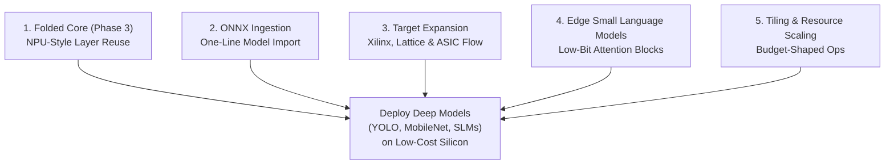

# SpinalML Roadmap

This document outlines the strategic development milestones for **SpinalML**.

SpinalML aims to enable efficient, cycle-accurate neural network execution on resource-constrained edge FPGAs and custom ASICs through high-level Scala/SpinalHDL descriptions.

> [!NOTE]
> For the exhaustive low-level engineering backlog and historical implementation log, refer to [**full_roadmap.md**](full_roadmap.md).

---

## Current Status: Solid Foundations (Phases 1 & 2)

The core architectural foundations are implemented and physically validated:
- **Dual-Target Architecture**: Clean separation between portable RTL (`Target.FPGA` vs `Target.ASIC`), abstract memory adapters (`MemoryAdapter`), and physical board constraints.
- **Synchronous Memory Infrastructure**: BRAM-inferred circular line buffers (`LineBuffer2D`), autonomous AXI4 DMA engines (`DMAReader`, `DMAWriter`), and ping-pong buffers (`StreamDoubleBuffer`).
- **Mixed-Precision Arithmetic**: Support for INT4/INT8 integer quantization, FP8 (E4M3, E5M2), and BF16, with runtime programmable scale registers (CSR `0x30`).
- **Physical Silicon Deployment**: End-to-end mixed-precision CNN inference validated on the Sipeed Tang Primer 20K (Gowin GW2A-18) over UART.
- **Rigorous Verification**: Formal property proofs (SymbiYosys), cycle-accurate C++ co-simulations (Verilator 5), and bit-exact software reference oracles (`deviation = 0.000`).

---

## Strategic Development Pillars

---

### 1. Phase 3: Folded Core Architecture (NPU-Style Layer Reuse)

- **Challenge**: The current spatial pipeline instantiates dedicated hardware for each layer. While efficient for compact models (such as MNIST), deep architectures with 50+ layers (e.g., YOLO or ResNet) exceed the logic capacity of edge FPGAs and increase ASIC die area.
- **Solution**: Implement temporal layer folding. A unified, parameterized compute engine executes layers sequentially by reading activations and weights from memory (DDR/SRAM) via `DMAReader`, performing the computation, and streaming results back via `DMAWriter` before triggering the next layer pass.
- **Key Milestones**:
  - [ ] Micro-coded layer sequencer and execution controller.
  - [ ] Unified multi-function execution unit (configurable for Conv2D, GEMM, and pooling).
  - [ ] Activation double-buffering between DDR and on-chip SRAM.

---

### 2. Automated ONNX Model Ingestion

- **Challenge**: Defining model architectures manually in Scala requires converting weights, biases, and quantization parameters by hand.
- **Solution**: A compiler frontend that imports standard ONNX graph files and automatically outputs SpinalML hardware topologies.
- **Key Milestones**:
  - [ ] ONNX protobuf parser mapping standard operators (`Conv`, `Relu`, `MaxPool`, `Gemm`, `MatMul`) to SpinalML `LayerSpec`.
  - [ ] Automatic extraction and beat-aligned packing of weights and dequantization scales.
  - [ ] Single-command CLI compilation: `spinalml build model.onnx --board tang-primer-20k`.

---

### 3. Target Expansion: Broader FPGAs & Clean ASIC Flow

- **Challenge**: Validating hardware on diverse FPGA vendors and ensuring tapeout readiness on open-source semiconductor process design kits (PDKs).
- **Solution**: Extend target profiles and provide automated ASIC synthesis and physical design scripts.
- **Key Milestones**:
  - [ ] **FPGA Target Expansion**: Physical board validation on AMD/Xilinx Artix-7 (Digilent Arty A7), Lattice iCE40/ECP5, and Intel MAX 10. See [**roadmap_board.md**](roadmap_board.md) for the complete hardware matrix.
  - [ ] **ASIC Tapeout Flow**: Integration with OpenLane and SkyWater 130nm PDK (Tiny Tapeout and Caravel harness compatibility).
  - [ ] Automated timing-driven standard cell synthesis and OpenRAM macro generation.

---

### 4. Edge Small Language Models (SLM)

- **Challenge**: Running language models locally on edge devices requires specialized streaming attention blocks and extreme weight quantization.
- **Solution**: Implement hardware-efficient Transformer building blocks tailored for token-by-token autoregressive generation.
- **Key Milestones**:
  - [ ] Key-Value (KV) cache memory management over AXI4.
  - [ ] Streaming Softmax with hardware exponent LUTs and dynamic online normalization.
  - [ ] Rotary Position Embeddings (RoPE) and RMSNorm operators.
  - [ ] INT4 weight-only quantized Multi-Head Attention blocks.

---

### 5. Tiling & Resource Scaling (Budget-Shaped Ops)

- **Challenge**: layer hardware is currently sized *by the layer's shape* (`Linear -> inFeatures` lanes, `Conv2D -> K²`), so silicon area explodes with model width and each op is locked to whatever its dimensions dictate.
- **Solution**: first-class tiling axes — M/K/N **slices** for data blocking (BRAM/DDR traffic) and M/N **tiles** for instantiated parallelism (LUT/DSP) — plus `lanes` for the datapath width. A global `TilingPolicy` is resolved per layer by an elaboration-time planner from the board budget (BSRAM/LUT/DSP/bandwidth), with fail-fast fit checks. This is the resource-shaping foundation of the folded core (pillar 1) and of deep-model deployment on edge silicon.
- **Key Milestones**:
  - [ ] R0 — resource model + `reportResources` (LUT/FF/BRAM/DSP/cycles/traffic per layer, board-calibrated).
  - [ ] R1 — unified `Tiling` API on `Linear`/`MatmulOp` + `TilingPolicy`.
  - [ ] R2 — N then M axis implementation (bit-exact e2e, replica + formal).
  - [ ] R3 — board-driven planner: budget -> per-layer tiling, fail-fast, report.
- See [**tiling_resource_scaling.md**](tiling_resource_scaling.md) for the vocabulary, the decomposition constraints (buffers, bandwidth, numeric order, framing) and the full phased plan.
