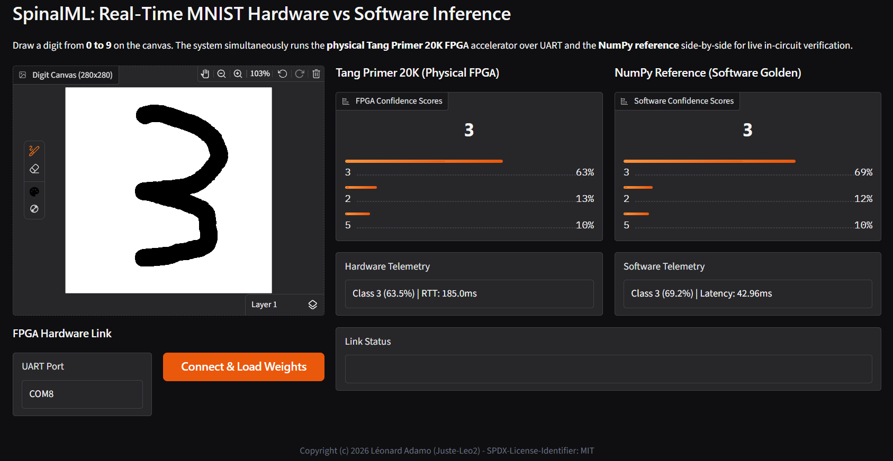
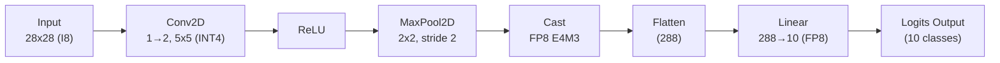

# MNIST Hardware Accelerator on Sipeed Tang Primer 20K

This example demonstrates a complete, end-to-end Machine Learning accelerator for handwritten digit recognition (**MNIST**) synthesized and deployed on the **Sipeed Tang Primer 20K** FPGA (Gowin GW2A-18).

It features:
1. A **hardware neural network accelerator in Scala** ([`Model.scala`](Model.scala)) described with the SpinalML High-Level API.
2. A **pre-compiled bitstream** ([`top.fs`](top.fs)) ready to flash directly to your Tang Primer 20K board.
3. A **Gradio web interface with Canvas** ([`inference.py`](inference.py)) to draw digits with a mouse or stylus in real time.
4. A **real-time UART host client** streaming drawings to the physical FPGA and running a side-by-side comparison against a local NumPy reference model.



---

## 1. Network Architecture (W4A8 Mixed-Precision)

The accelerator implements a compact, hardware-optimized Convolutional Neural Network tailored for edge FPGAs:




> [!NOTE]
> The FPGA accelerator outputs raw **FP8_E4M3 logits**. Softmax probability normalization is computed on the host side in [`inference.py`](inference.py) to display confidence scores in the UI, avoiding unnecessary hardware exponentiation/division logic.

- **Mixed-Precision Benefits**: INT4 convolution weights drastically minimize BRAM footprint while FP8 dense layers preserve dynamic range for final classification.
- **Approximations & Numerical Behavior**: Because fixed-point quantization and rounding approximations are applied across the INT4/INT16/FP8 pipeline, the FPGA output and the floating-point reference are not strictly bit-exact on every fringe input. However, the predicted classes align with high confidence, demonstrating how effectively low-bit quantization operates in real-time edge silicon.

> [!TIP]
> **Model Capacity & Accuracy:** This accelerator is an ultra-compact lightweight network (only 2 convolution channels and ~2.9 KB of total parameters) designed to run entirely on on-chip FPGA memory without external DRAM. Because of this small footprint, atypical, noisy, or off-center handwriting styles may occasionally lead to false predictions. Drawing clearly in the center of the canvas yields the best results.

---

## 2. Hardware Resource Utilization (Tang Primer 20K)

Synthesized using **Yosys** and placed & routed via **nextpnr-himbaechel** for the Gowin GW2A-LV18PG256C8/I7:

| Resource | Used | Capacity | Utilization | Status |
| :--- | :---: | :---: | :---: | :---: |
| **Logic (LUT4)** | **14,630** | 20,736 | **70.6 %** | OK |
| **Registers (FF)** | **5,977** | 15,552 | **38.4 %** | OK |
| **Block RAM (BSRAM)** | **27** | 46 | **58.7 %** | OK |
| **DSP (MULT)** | **0** | 48 | **0.0 %** (`--no-dsp`) | OK |

### Timing & Performance Summary
- **Target Clock**: 27.00 MHz
- **Estimated Fmax**: **45.93 MHz** (Timing constraints MET, +18.93 MHz slack)
- **Bitstream Size**: ~7.09 MB (`top.fs`)
- **Inference Latency**:
  - **~180 ms per inference over UART** (including 784-byte image transmission at 115,200 baud, FPGA hardware execution, and 10-class logit retrieval).
  - **~440 ms on first run** (includes automatic one-time upload of the 2,936-byte weight payload into FPGA BRAM).

---

## 3. Installation & Environment Setup

> [!IMPORTANT]
> **Work from the repository root:** Ensure your Python virtual environment (`.venv`) is activated at the root of the `spinalML` project before running commands.

Install the required dependencies directly using `uv` (or standard `pip`):

```bash
# From the repository root (spinalML):
uv pip install -r examples/Mnist/requirements.txt
```

*(Alternatively: `pip install -r examples/Mnist/requirements.txt`)*

---

## 4. Flash or Build the Hardware Accelerator

From the root of the `spinalML` repository:

### Option A: Flash Pre-compiled Bitstream (Fastest)

A pre-compiled bitstream [`examples/Mnist/top.fs`](top.fs) is included directly in this folder. You can flash it immediately to your Tang Primer 20K:

```bash
python cli/main.py flash examples/Mnist/top.fs --board tang-primer-20k
```

---

### Option B: Synthesize and Build from Source

If you want to re-synthesize the hardware design using Yosys and nextpnr:

```bash
# Step 1: Synthesize and generate the bitstream
python cli/main.py build examples/Mnist/Model.scala --board tang-primer-20k --no-dsp

# Step 2: Flash the generated bitstream
python cli/main.py flash hw_build/tang-primer-20k/top.fs --board tang-primer-20k
```

> [!TIP]
> The `--no-dsp` flag ensures safe synthesis into FPGA LUTs on the Gowin GW2A-18, eliminating DSP routing bottlenecks.

---

## 5. Run the Interactive Web Demo

Launch the Gradio drawing application from the repository root:

```bash
python examples/Mnist/inference.py
```

1. Open your browser at **`http://127.0.0.1:7860`**.
2. Select your FPGA serial port (e.g. `COM8` on Windows or `/dev/ttyUSB0` on Linux).
3. Click **"Connect & Load Weights"** to initialize communication and upload weights into BRAM.
4. Draw any digit (0–9) on the canvas: the physical Tang Primer 20K FPGA and the software reference will classify your drawing side-by-side in real time!